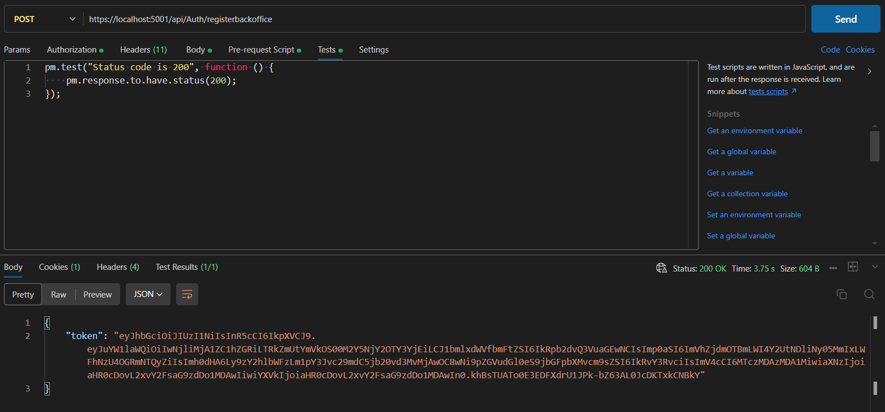

# US 1 - Create a new Backoffice User

As an **Admin**, I want to register new backoffice users (e.g., doctors, nurses,
technicians, admins) via an out-of-band process, so that they can access the
backoffice system with appropriate permissions.

## 1. Context

This US is part of **Sprint A**, as part of the **USs regarding User Management**.

## 2. Requirements

### 2.1. Acceptance Criteria

1. Backoffice users (e.g., doctors, nurses, technicians) are **registered by an Admin** via an **internal process**, not via self-registration.
2. Admin **assigns roles** (e.g., Doctor, Nurse, Technician) during the registration process.
3. Registered users receive a **one-time setup link via email** to **set their password** and **activate their account**.
4. The system enforces **strong password requirements** for security.
5. A **confirmation email** is sent to verify the **user’s registration**.

### 2.2. Dependencies

This **US** has no dependencies.

### 2.3. Pre-Conditions

This **US** has no pre-conditions.

### 2.4. Open Questions

* **Question 1:** Can you please clarify if backoffice users registration uses the IAM system? And if the IAM system is the out-of-band process?
    * **Answer 1:** what this means is that backoffice users can not self-register in the system like the patients do. the admin must register the backoffice user. If you are using an external IAM (e.g., Google, Azzure, Linkedin, ...) the backoffice user must first create their account in the IAM provider and then pass the credential info to the admin so that the user account in the system is "linked" wit the external identity provider.

* **Question 2:** What does the client define as an out-of-band process?
    * **Answer 2:** this applies mainly to the use of an external IAM module. it means the creation of the account is done at the IAM, thus is done outside of the system we are building.

* **Question 3:** A palavra-passe que os utilizadores irão definir será para o login no Google IAM (neste caso estamos a usar a IAM do google) ou será uma palavra-passe separada para aceder à aplicação? Se for uma palavra-passe separada, qual é a sua relevância, tendo em conta que o cliente referiu que tanto os backoffice users como os pacientes devem autenticar-se pelo IAM? Além disso, essa palavra-passe será armazenada na base de dados?
    * **Answer 3:** se estiverem a usar um IAM externo os aspetos de criação/gestão da password são tratados no IAM e não no sistema, pelo que não se aplica receberem um link para configurar a password.
    * **Question 3.5:** Se não existe login com password por exemplo com a autenticação google a us 5.1.2 As a Backoffice User (Admin, Doctor, Nurse, Technician), I want to reset my password if I forget it, so that I can regain access to the system securely, não faz sentido certo?
    * **Answer 3.5:** certo. esse requisito aplica-se apenas se usarem um IAM interno.

## 3. Analysis

We can't link this **US** to the **Domain Model** since creating a **Backoffice User** is not domain related.

However, through the **Open Questions** we can conclude that this **Backoffice User Creation** can only be done by the admin. Unlike the **patients**, the **staff** themselves can't self register.

# 4. Design

Our team decided to use an **external IAM** for our system. Because of this, the part where the user can **change their password through the Confirmation Email** does not apply.

The class responsible for managing the registering of **Backoffice Users** will be the **AuthController** class. This class will:
* Make sure that only the admin can use this functionality.
* Validate that the admin isn't trying to register a **Patient** through this functionality.
* Redirect the other aspects to other classes.

The **UserManager** class will add the new user to the database.

The **IMessageSenderService** will send the **Confirmation notification** (in this case, an email) to the new User.

The section where the token is built is done outside the system by an external provider.

## 5. C4 Views

The **C4 Views** for this *US* can be viewed [here](views/readme.md).

## 6. Tests

### 6.1. Integration Tests

First, we have to make sure that we can't register a **Patient** through this functionality.


Then, we have to make sure that the program returns a **Ok** code and a token otherwise.



## 7. Integration

### AuthController

#### RegisterBackoffice

This block of code is the main method for this fuctionality, it:
* Checks that the user accessing this functionality has **Admin roles**.
* Checks that we're not trying to create a **Patient**
* Asks the **UserManager** to:
    * Create the new user.
    * Add the roles to the new user.
* Asks to create a **Token** with the necessary information.
* Calls the **SendEmailConfirmationEmail** method.

```cs
[HttpPost("registerbackoffice")]
[Authorize(Roles = HospitalRoles.Admin)]
public async Task<IActionResult> RegisterBackoffice([FromBody] RegisterBackofficeDTO dto) {
    if (!ModelState.IsValid) {
        return BadRequest(ModelState);
    }
    RoleType role = (RoleType)Enum.Parse(typeof(RoleType), dto.Role);
    if (role == RoleType.Patient)
        return BadRequest(dto.Role);

    var backofficeUser = new IdentityUser {
        UserName = dto.Username,
        Email = dto.Email,
        PhoneNumber = dto.Phone
    };
    var result = await UserManager.CreateAsync(backofficeUser, dto.Password);
    if (!result.Succeeded) {
        return BadRequest(result.Errors);
    }

    var userRoles = await UserManager.GetRolesAsync(backofficeUser);
    if (userRoles.Count > 0) {
        return BadRequest("User already has a role assigned.");
    }

    await UserManager.AddToRoleAsync(backofficeUser, dto.Role);

    var token = await BuildToken(backofficeUser);

    SendEmailConfirmationEmail(backofficeUser, token);

    return Ok(new { token });
}
```

#### SendEmailConfirmationEmail

This block of code formats a message that's then sent to the **IMessageSenderService**, so it can be sent to the desired recipient (the new user's email).

```cs
private void SendEmailConfirmationEmail(IdentityUser user, string token) {
    string appDomain = Configuration.GetSection("Application:AppDomain").Value,
        confirmationLink = Configuration.GetSection("Application:EmailConfirmation").Value,
        fullConfirmationLink = string.Format(appDomain + confirmationLink, user.Id, token);

    string emailBody = string.Format(
        "Hello {0},<br><br>" +
        "Please <a href=\"{1}\">verify your account</a> by clicking the link.<br><br>" +
        "Thank you!",
        user.UserName, fullConfirmationLink
    );

    MessageSender.SendMessage(user.Email, "Account Activation", emailBody);
}
```

#### ConfirmEmail

When the new user clicks the confirmation link, they're taken to an URL that calls this method, confirming their email and making that account able to login to the system.

```cs
[HttpGet("confirmation-email")]
public async Task ConfirmEmail(string uid, string token){
    if (!string.IsNullOrEmpty(uid) && !string.IsNullOrEmpty(token)){
        token = token.Replace(' ', '+');
        await UserManager.ConfirmEmailAsync(await UserManager.FindByIdAsync(uid), token);
    }
}
```

## 8. Demonstration

Since our system doesn't have a frontend yet, this section does not apply.

However, we can show how the **confirmation email** looks:


And this is how it looks when the user clicks the **confirmation link** when we don't have a **Frontend** system:

