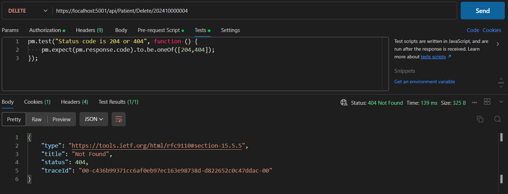
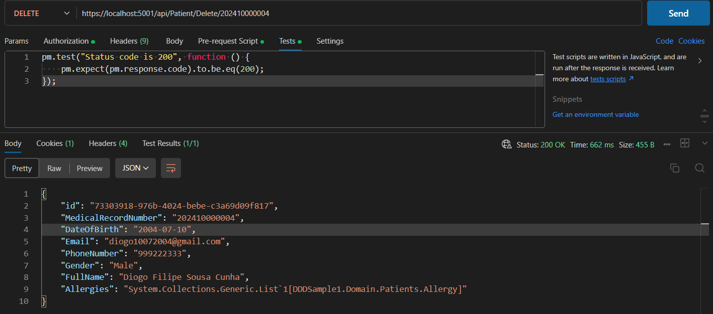

# US 10 - Delete a Patient Profile

As an **Admin**, I want to delete a patient profile, so that I can remove patients who
are no longer under care.

## 1. Context

This US is part of **Sprint A**, as part of the **Group of User Stories regarding patient profiles**.

## 2. Requirements

### 2.1. Acceptance Criteria

1. Admins can **search for** a patient profile to mark it for deletion.
2. Before deletion, the system **prompts the admin** to confirm the action.
3. Once deleted, all patient data is permanently removed from the system within a predefined time frame.
4. The system **logs the deletion** for audit and **GDPR** compliance purposes.

### 2.2. Dependencies

This **US** depends on:
* [**US8**](../us8/readme.md) (Explained in **2.3. Pre-Conditions**).
* [**US11**](../us11/readme.md), since, from a usability point of view, this functionality starts from **Patient Profile Search**.


### 2.3. Pre-Conditions

For this **US** to work, there needs to be a **Patient Profile** inside the system, hence the dependency on [**US8**](../us8/readme.md).

### 2.4. Open Questions

* **Question 1:** When generating the audit record to log the deletion of patient profiles what patient information (if any) are we allowed to keep in the log for identification purposes? If none are the logs then only a record of deletion operations and not actually tied to the deletion of a specific patient?
    * **Answer:** The ERS (health regulator) issued an opinion on the retention of health data in which it established a minimum retention period of 5 years, after which the data can be deleted. 

        You may wish to keep some of the information anonymised for statistical purposes only, limiting yourself to, for example, gender and type of surgery.

## 3. Analysis

The domain model includes everything that's needed in order to perform this *US* as intended.

The sections in red show what is related to this *US*:


## 4. Design

The team decided that: 
* The **Patient Profile** to be deleted should be specified by their **Medical Record Number**, since it's a unique identifier with actual domain meaning.
* The **Medical Record Number** should be sent through the URL.
* If the **Patient Profile** was successfully deleted, the program should return a **DTO** with the data that was just deleted and an **Ok** Return Code.

## 5. C4 Views

The **C4 Views** for this *US* can be viewed [here](views/readme.md).

## 6. Tests

### 6.1. Unit Tests

#### PatientControllerTest

We tested the Controller with 2 scenarios:

1. Make sure that the Controller returns a **NotFound** message code when the requested **Patient Profile** doesn't exist.

    ```cs
    [Fact]
    public async Task DeletePatient_ReturnsNotFoundWhenGettingNull() {
        // Setup mock to return Task with null when DeletePatient is called
        _mockService.Setup(s => s.DeletePatient(It.IsAny<MedicalRecordNumber>()))
            .Returns(Task.FromResult<PatientDTO>(null));

        // Act
        var result = await _controller.DeletePatient("202410000004"); //Random MedicalRecordNumber

        // Assert
        var actionResult = Assert.IsType<NotFoundResult>(result.Result);
    }
    ```

2. Make sure that the **Controller** returns an **Ok** message code and the **DTO** of the **Patient Profile** that was just deleted otherwise.

    ```cs

    [Fact]
    public async Task DeletePatient_ReturnsOkAndDTOWhenGettingDTO() {
        // Arrange
        var patientDto = SeedPatientDTO();
        
        // Setup mock to return the DTO when DeletePatient is called
        _mockService.Setup(s => s.DeletePatient(It.IsAny<MedicalRecordNumber>()))
            .ReturnsAsync(patientDto);

        // Act
        var result = await _controller.DeletePatient(patientDto.MedicalRecordNumber);

        // Assert
        var actionResult = Assert.IsType<OkObjectResult>(result.Result);
        var returnValue = Assert.IsType<PatientDTO>(actionResult.Value);

        Assert.Equal(patientDto, returnValue);
    }

#### PatientServiceTest

We tested the Service with 2 scenarios:

1. Make sure that the Service returns **null** when the requested **Patient Profile** doesn't exist.

    ```cs
    [Fact]
    public async Task DeletePatient_ReturnsNullWhenPatientDoesntExist() {
        // Setup mock to return Task with null when DeletePatient is called
        _mockPatRepo.Setup(r => r.GetPatientByRecordNumber(It.IsAny<MedicalRecordNumber>()))
            .Returns((Patient)null);

        // Act
        var result = await _service.DeletePatient(new MedicalRecordNumber("202410000004")); //Random MedicalRecordNumber

        // Assert
        Assert.Null(result);
    }
    ```

2. Make sure that the **Service** returns the **DTO** of the **Patient Profile** that was just deleted otherwise.

    ```cs
    [Fact]
    public async Task DeletePatient_ReturnsDTOWhenPatientExists() {
        var patientDto = SeedPatientDTO();
        // Setup mock to return Task with null when DeletePatient is called
        _mockPatRepo.Setup(r => r.GetPatientByRecordNumber(It.IsAny<MedicalRecordNumber>()))
            .Returns(Patient.createFromDTO(patientDto));

        // Act
        var result = await _service.DeletePatient(new MedicalRecordNumber(patientDto.MedicalRecordNumber)); //Random MedicalRecordNumber

        // Assert
        result.Should().BeEquivalentTo(patientDto);
    }
    ```

### 6.2. Integration Tests

First, we have to make sure that we can't delete a user that doesn't exist **(Exit Code = 404)**:



Then, we can show a case of an existing user being deleted **(Exit Code = 200)**:



## 7. Implementation

### PatientController

The **PatientController** receives a **HttpDelete** request and returns **NotFound()** if the **Patient Profile** doesn't exist. Otherwise it returns **Ok(pat)**.

```cs
[HttpDelete("Delete/{record}")]
[Authorize(Roles = HospitalRoles.Admin)]
public async Task<ActionResult<PatientDTO>> DeletePatient(string record) {
    try {
        var pat = await _service.DeletePatient(new MedicalRecordNumber(record));
        if (pat == null) return NotFound();
        return Ok(pat);
    }
    catch (BusinessRuleValidationException ex) {
        return BadRequest(new { ex.Message });
    }
}
```

### PatientService

Using the **MedicalRecordNumber**, the **PatientService** calls the repository to get the **patient** instance, deleting it from the same repository (or returning null if it the instance is null).

```cs
public async virtual Task<PatientDTO> DeletePatient(MedicalRecordNumber id){
    var patient = this._repository.GetPatientByRecordNumber(id);
    if (patient == null) return null;
    
    this._repository.Remove(patient);
    await this._logRepository.AddAsync(new DomainLog(LogObjectType.Patient, LogActionType.Deletion, 
        string.Format("Deleted Patient with Medical Record Number = {0}", patient.MedicalRecordNumber.Record)));
    await this._unitOfWork.CommitAsync();

    return patient.returnDTO();
}
```

## 8. Demonstration

As this project doesn't have a **Frontend** yet, this section doesn't apply.