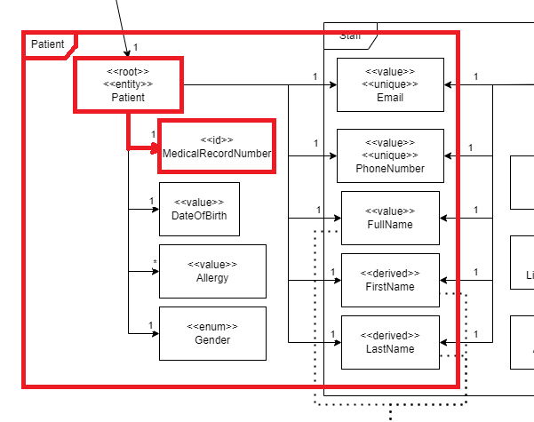

# US 10 - Delete a Patient Profile

As an **Admin**, I want to delete a patient profile, so that I can remove patients who
are no longer under care.

## 1. Context

This US is part of **Sprint A**, as part of the **Group of User Stories regarding patient profiles**.

## 2. Requirements

### 2.1. Acceptance Criteria

1. Admins can **search for** a patient profile to mark it for deletion.
2. Before deletion, the system **prompts the admin** to confirm the action.
3. Once deleted, all patient data is permanently removed from the system within a predefined time frame.
4. The system **logs the deletion** for audit and **GDPR** compliance purposes.

### 2.2. Dependencies

This **US** depends on:
* [**US8**](../us8/readme.md) (Explained in **2.3. Pre-Conditions**).
* [**US11**](../us11/readme.md), since, from a usability point of view, this functionality starts from **Patient Profile Search**.

### 2.3. Pre-Conditions

For this **US** to work, there needs to be a **Patient Profile** inside the system, hence the dependency on [**US8**](../us8/readme.md).

### 2.4. Open Questions

* **Question 1:** When generating the audit record to log the deletion of patient profiles what patient information (if any) are we allowed to keep in the log for identification purposes? If none are the logs then only a record of deletion operations and not actually tied to the deletion of a specific patient?
    * **Answer:** The ERS (health regulator) issued an opinion on the retention of health data in which it established a minimum retention period of 5 years, after which the data can be deleted. 

        You may wish to keep some of the information anonymised for statistical purposes only, limiting yourself to, for example, gender and type of surgery.

## 3. Analysis

The domain model includes everything that's needed in order to perform this *US* as intended.

The sections in red show what is related to this *US*:

## 4. Design

The team decided that: 
* The **Patient Profile** to be deleted should be specified by their **Medical Record Number**, since it's a unique identifier with actual domain meaning.
* The **Medical Record Number** should be sent through the URL.
* If the **Patient Profile** was successfully deleted, the program should return a **DTO** with the data that was just deleted and an **Ok** Return Code.