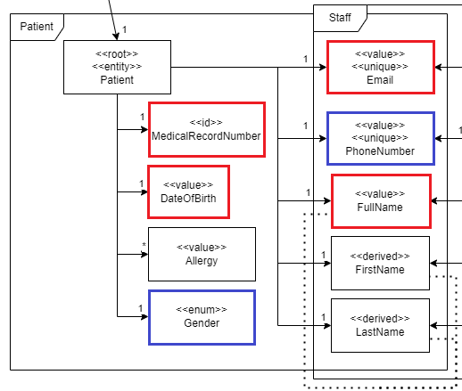
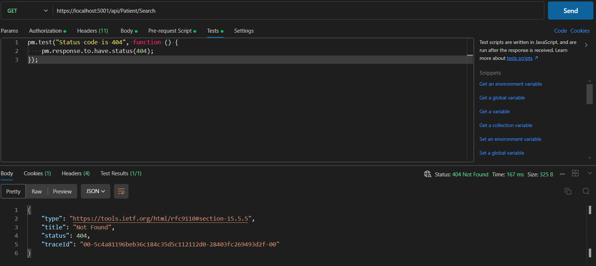
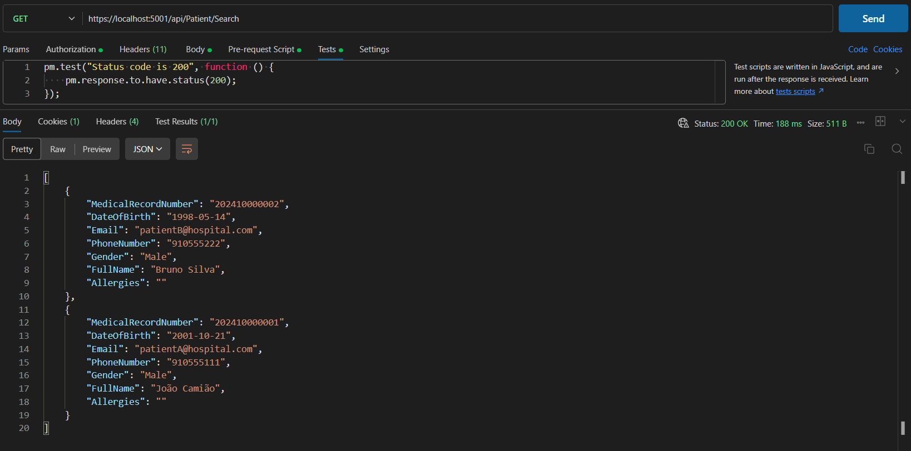
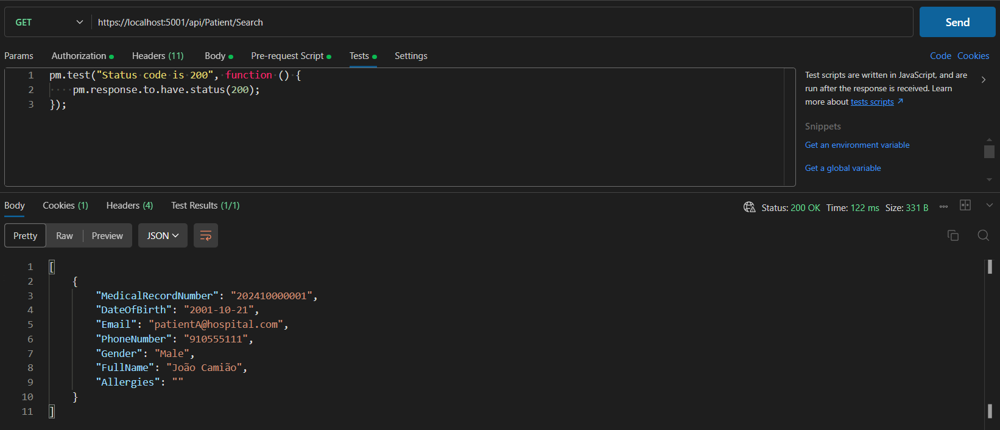

# US 11 - List/Search Patient Profiles

As an **Admin**, I want to list/search patient profiles by different attributes, so that I can view the details, edit, and remove patient profiles.

## 1. Context

This US is part of **Sprint A**, as part of the **Group of User Stories regarding patient profiles**.

## 2. Requirements

### 2.1. Acceptance Criteria

1. Admins can **search patient profiles** by various attributes, including **name**, **email**, **date of birth**, or **medical record number**.
2. The system displays search results in a list view with key patient information (name, email, date of birth).
3. Admins can **select a profile from the list** to view, edit or delete the patient record.
4. The search results are **paginated**, and filters are available to refine the search results.

### 2.2. Dependencies

This **US** depends on:
* [**US8**](../us8/readme.md) (Explained in **2.3. Pre-Conditions**).

### 2.3. Pre-Conditions

For this **US** to work, there needs to be a **Patient Profile** inside the system, hence the dependency on [**US8**](../us8/readme.md).

### 2.4. Open Questions

This **US** has no **Open Questions** yet.

## 3. Analysis

The domain model includes everything that's needed in order to perform this *US* as intended.

The sections in red show what is related to this *US*:
* Since the **MedicalRecordNumber** and the **Email** are unique values, filtering the results by one of these will result in, at most, only one **Patient** showing up.



## 4. Design

The team decided that: 
* There should me more options for filtering results. Those are the sections in [**blue**]() in the previous image. (**Gender** and **PhoneNumber**).
    * Since **PhoneNumber** is a unique value, filtering the results by this value will result in, at most, only one **Patient** showing up.
* The program shall return an **Ok** code if there's at least 1 entry in the list. Otherwise, it should return a **NotFound** code.

## 5. C4 Views

The **C4 Views** for this *US* can be viewed [here](views/readme.md).

## 6. Tests

#### PatientControllerTest

We tested the Controller with 2 scenarios:

1. Make sure that the Controller returns a **NotFound** message code when getting **null** from the service.

    ```cs
    [Fact]
    public async Task SearchPatient_ReturnsNotFoundWhenGettingNull() {        
        // Setup mock to return null when SearchAndFilterPatients is called
        _mockService.Setup(s => s.SearchPatients(It.IsAny<FilterPatientDTO>()))
            .Returns(Task.FromResult((IEnumerable<PatientDTO>)null));

        // Act
        var result = await _controller.SearchAndFilterPatients(SeedFilterPatientDTO());

        // Assert
        var actionResult = Assert.IsType<NotFoundResult>(result.Result);
    }
    ```

2. Make sure that the **Controller** returns an **Ok** message code and a list of **DTO** otherwise.

    ```cs

    [Fact]
    public async Task SearchPatient_ReturnsOkAndListDTOWhenGettingList() {        
        // Setup mock to return the list of DTOs when SearchAndFilterPatients is called
        _mockService.Setup(s => s.SearchPatients(It.IsAny<FilterPatientDTO>()))
            .Returns(Task.FromResult(new List<PatientDTO>{SeedPatientDTO()}.AsEnumerable()));

        // Act
        var result = await _controller.SearchAndFilterPatients(SeedFilterPatientDTO());

        // Assert
        var actionResult = Assert.IsType<OkObjectResult>(result.Result);
        var returnValue = Assert.IsType<List<PatientDTO>>(actionResult.Value);
    }
    ```

#### PatientServiceTest

We tested the Service with 3 scenarios:

1. Make sure that the Service returns **null** when no **Patient Profile** matches the filter request.

    ```cs
    [Fact]
    public async Task SearchPatient_ReturnsNullWhenListEmpty() {
        PatientDTO dto = SeedPatientDTOWithoutMedicalRecord();
        //Setup
        _mockPatRepo.Setup(r => r.GetAllAsync())
            .Returns(Task.FromResult(new List<Patient>{Patient.createFromDTO(SeedPatientDTO1()), Patient.createFromDTO(SeedPatientDTO2())}));
        // Act
        var result = await _service.SearchPatients(SeedFilterPatientDTOWithSensitiveData()); //Email and PhoneNumber won't appear
        // Assert
        Assert.Null(result);
    }
    ```

2. Make sure that the **Service** return a single **PatientDTO** when filtering by one or more unique values (Like **Email** and **PhoneNumber**).

    ```cs
    [Fact]
    public async Task SearchPatient_ReturnsFilteredListWhenListNotEmptyEmailPhoneNumber() {
        PatientDTO dto = SeedPatientDTOWithoutMedicalRecord();
        //Setup
        _mockPatRepo.Setup(r => r.GetAllAsync())
            .Returns(Task.FromResult(new List<Patient>{Patient.createFromDTO(SeedPatientDTO1()), Patient.createFromDTO(SeedPatientDTO2()), Patient.createFromDTO(SeedPatientDTO3())}));
        // Act
        var results = await _service.SearchPatients(SeedFilterPatientDTOWithSensitiveData()); //Email and PhoneNumber will match with third patient
        var result = Assert.Single(results);
        // Assert
        Assert.Equal("novo@gmail.com", result.Email);
        Assert.Equal("912834756", result.PhoneNumber);
    }
    ```

3. Make sure that the **Service** returns a list of **DTOs** otherwise, and that all the values match the request.

    ```cs
    [Fact]
    public async Task SearchPatient_ReturnsFilteredListWhenListNotEmptyGender() {
        PatientDTO dto = SeedPatientDTOWithoutMedicalRecord();
        //Setup
        _mockPatRepo.Setup(r => r.GetAllAsync())
            .Returns(Task.FromResult(new List<Patient>{Patient.createFromDTO(SeedPatientDTO1()), Patient.createFromDTO(SeedPatientDTO2()), Patient.createFromDTO(SeedPatientDTO3())}));
        // Act
        var results = await _service.SearchPatients(SeedFilterPatientDTOWithOnlyGender()); //Two results will appear
        // Assert
        Assert.All(results, result => Assert.Equal("Male", result.Gender));
    }
    ```

### 6.2. Integration Tests

First, we have to make sure that we get a **Not Found** message code when no **Patient** matches our request:



Then, we can show a case of a list of **Patients** filtered by **Gender** **(Exit Code = 200)**:

    

Finally, we can show a case where only one **Patient** is showed since we filtered with a unique identifier (in this case, **MedicalRecordNumber**) **(Exit Code = 200)**:

    

## 7. Implementation

### PatientController

The **PatientController** receives a **HttpGet** request and returns **NotFound()** if it gets **null** from the service. Otherwise it returns **Ok(list)**.

```cs
[HttpGet("Search")]
[Authorize(Roles = HospitalRoles.Admin)]
public async Task<ActionResult<IEnumerable<PatientDTO>>> SearchAndFilterPatients(FilterPatientDTO filterPatientDTO){
    var patients = await _service.SearchPatients(filterPatientDTO);
    if (patients == null) return NotFound();
    return Ok(patients.ToList());
}
```

### PatientService

The **PatientService** calls the repository to get the list of **patients**. Then, it filters the list according to what attributes exist in the received **FilterPatientDTO**.

```cs
public async virtual Task<IEnumerable<PatientDTO>> SearchPatients(FilterPatientDTO filterPatientDTO)
{
    var patients = await GetAll();

    if (!string.IsNullOrEmpty(filterPatientDTO.MedicalRecordNumber))
        patients = patients.Where(p => p.MedicalRecordNumber.Equals(filterPatientDTO.MedicalRecordNumber));
    if (!string.IsNullOrEmpty(filterPatientDTO.Email))
        patients = patients.Where(p => p.Email.Contains(filterPatientDTO.Email, StringComparison.OrdinalIgnoreCase));
    if (!string.IsNullOrEmpty(filterPatientDTO.PhoneNumber))
        patients = patients.Where(p => p.PhoneNumber.Contains(filterPatientDTO.PhoneNumber));
    if (!string.IsNullOrEmpty(filterPatientDTO.FullName))
        patients = patients.Where(p => p.FullName.Contains(filterPatientDTO.FullName, StringComparison.OrdinalIgnoreCase));
    if (filterPatientDTO.DateOfBirth.HasValue)
        patients = patients.Where(p => p.DateOfBirth.Equals(filterPatientDTO.DateOfBirth));    
    if (!string.IsNullOrEmpty(filterPatientDTO.Gender))
        patients = patients.Where(p => p.Gender.Equals(filterPatientDTO.Gender));

    return patients.IsNullOrEmpty() ? null : patients;
}
```

## 8. Demonstration

As this project doesn't have a **Frontend** yet, this section doesn't apply.