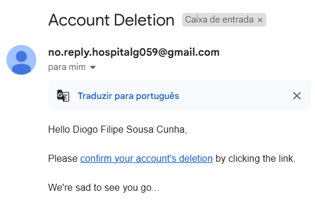
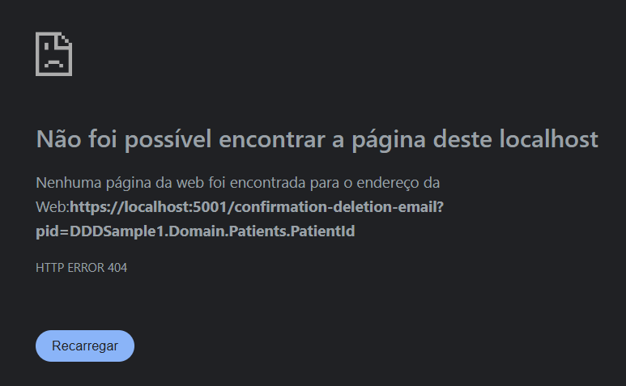

# US 5 - Delete a Patient's Information

As an **Patient**, I want to delete my account and all associated data, so that I can exercise my right to be forgotten as per GDPR

## 1. Context

This US is part of **Sprint A**, as part of the **Group of User Stories regarding user management**.

## 2. Requirements

### 2.1. Acceptance Criteria

1. Patients can request to delete their account through the profile settings.
2. The system sends a confirmation email to the patient before proceeding with account deletion.
3. Upon confirmation, all personal data is permanently deleted from the system within the legally required time frame (e.g., 30 days).
4. Patients are notified once the deletion is complete, and the system logs the action for GDPR compliance.
5. Some anonymized data may be retained for legal or research purposes, but all identifiable information is erased.

### 2.2. Dependencies

This **US** depends on:
* [**US3**](../us8/readme.md) (Explained in **2.3. Pre-Conditions**).

### 2.3. Pre-Conditions

For this **US** to work, there needs to be a **Patient User** inside the system, hence the dependency on [**US3**](../us3/readme.md).

### 2.4. Open Questions

*No **Open questions***.

## 3. Analysis

When the **Patient** clicks to delete their profile, it's only **marked for deletion**. The profile is only deleted when they press the **confirmation link** sent through email.

As the **Acceptance Criteria** states, every piece of data that mentions the deleted **Patient** must be at least anonymized. Hence, this **US** affects not just the **Patient aggregate**, but also the **Operation Request aggregate** (since an Operation Request is related to a Patient) and any **Logs** that contain personal data about the Patient.

## 4. Design

The **Http** requests shall be received by the existing class **AuthController**. It will have two methods:
1. One for marking the initial request of deleting the profile, sending an **email notification** to the **Patient's Email Address**.
2. Other for actually deleting it.

## 5. C4 Views

The **C4 Views** for this *US* can be viewed [here](views/readme.md).

## 6. Tests

### 6.1. Integration Tests

We have to make sure that the program returns a **Ok** code.


## 7. Implementation

This is the method that checks the current user's **Patient Profile**.

```cs
[HttpDelete("DeleteProfile")]
[Authorize(Roles = HospitalRoles.Patient)]
public IActionResult DeletePatientProfile() {
    MailAddress email = new(_httpContextAccessor.HttpContext?.User?.FindFirst(ClaimTypes.Email)?.Value);
    Patient pat = CheckCurrentUsersPatientProfile(email);
    //Ok
    SendAccountDeletionEmail(email, pat);
    return Ok(pat.returnDTO());
}
```

This is the method that initially sends an **email verification** to the Patient's email address.

```cs
private void SendAccountDeletionEmail(MailAddress recipient, Patient pat){
    string appDomain = Configuration.GetSection("Application:AppDomain").Value,
        confirmationLink = Configuration.GetSection("Application:EmailDeletionConfirmation").Value,
        fullConfirmationLink = string.Format(appDomain + confirmationLink, pat.Id);

    string emailBody = string.Format(
        "Hello {0},<br><br>" +
        "Please <a href=\"{1}\">confirm your account's deletion</a> by clicking the link.<br><br>" +
        "We're sad to see you go...",
        pat.FullName.ToString(), fullConfirmationLink
    );

    MessageSender.SendMessage(recipient.ToString(), "Account Deletion", emailBody);
}
```

After the user clicks the link that was sent to them via an **email notification**, this method is called:

```cs
[HttpDelete("confirmation-deletion-email")]
[Authorize(Roles = HospitalRoles.Patient)]
public async Task<IActionResult> DeletePatientProfileAndRecordsAsync() {
    string email = _httpContextAccessor.HttpContext?.User?.FindFirst(ClaimTypes.Email)?.Value;
    await UserManager.DeleteAsync(await UserManager.FindByEmailAsync(email));
    var pat = _patientRepository.GetByUserEmail(new MailAddress(email));
    _patientRepository.Remove(pat);
    await _unitOfWork.CommitAsync();
    return Ok(pat.returnDTO());
}
```

## 8. Demonstration

Since our system doesn't have a frontend yet, this section does not apply.

However, we can show how the **confirmation email** looks:



And this is how it looks when the user clicks the **confirmation link** when we don't have a **Frontend** system:

