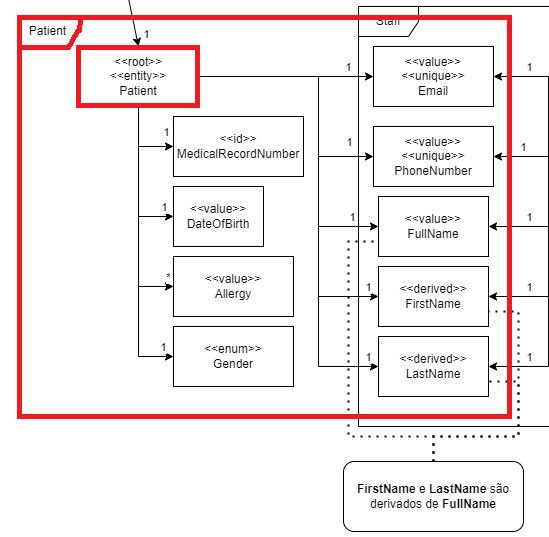
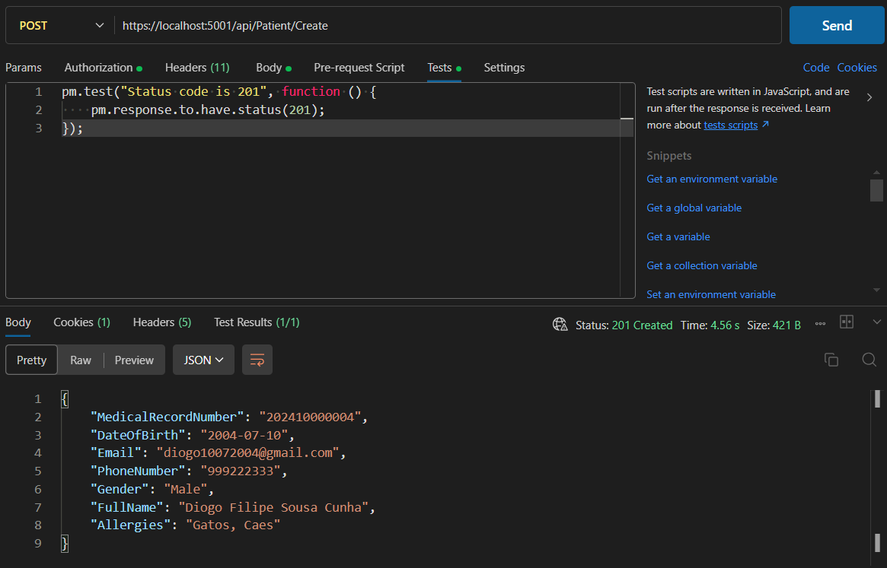

# US 8 - Create a new Patient Profile

As an **Admin**, I want to create a new patient profile, so that I can register their personal details and medical history.

## 1. Context

This US is part of **Sprint A**, as part of the **Group of User Stories regarding patient profiles**.

## 2. Requirements

### 2.1. Acceptance Criteria

1. Admins can input patient details such as **first name**, **last name**, **date of birth**, **contact information**, and **medical history**.
2. A **unique patient ID (Medical Record Number)** is generated upon profile creation.
3. The system validates that **the patient's email and phone number are unique**.
4. The profile is stored securely in the system, and **access is governed by role-based permissions**.

### 2.2. Dependencies

This **US** has no dependencies.

### 2.3. Pre-Conditions

This **US** has no pre-conditions.

### 2.4. Open Questions

* **Question 1:** When an Admin creates a patient profile, should he already register them in the system, as users that can login, or should the registration always be responsibility of the patient?
If the latter is intended, should the patient's user credentials be linked to the existing profile?
    * **Answer 1:** registering a patient record is a separate action from the patient self-registering as a user.
    * **Question 1.5:** How does the activation happen? If that pacient eventualy wants to register himself, should there be an option to activate an existing profile? For example, associate the e-mail from registration input with the existing profile's e-mail?
    * **Answer 1.5:** the admin register the patient (this does not create a user for that patient)
optionally, the patient self-registers in the system by providing the same email that is currently recorded in their patient record and the system associates the user and the patient
there is no option for someone who is not a patient of the system to register as a user

* **Question 2:** It is specified that the admin can input some of the patient's information (name, date of birth, contact information, and medical history).

    Do they also input the omitted information (gender, emergency contact and allergies/medical condition)?
Additionally, does the medical history that the admin inputs refer to the patient's medical record, or is it referring to the appointment history?
    * **Answer 2:** the admin can not input medical history nor allergies. they can however input gender and emergency contact.

## 3. Analysis

The domain model includes everything that's needed in order to perform this *US* as intended.



Everything in this image is part of the **Patient Profile** creation, with only the **Allergies** being an optional attribute.

## 4. Design

The team decided that: 
* If the **Patient Profile** was successfully created, the program should return a **DTO** with the data that was just created and an **Created** Return Code.

## 5. C4 Views

The **C4 Views** for this *US* can be viewed [here](views/readme.md).

## 6. Tests

### 6.1. Unit Tests

#### PatientControllerTest

We tested the Controller with the following scenario:

1. Make sure that the **Controller** returns an **Created** message code and the **DTO** of the **Patient Profile** that was just created.

```cs

[Fact]
public async Task CreatePatient_ReturnsCreatedAtAction_WithPatientDTO() {
    // Arrange
    var patientDto = SeedPatientDTO();
    
    // Setup mock to return the DTO when CreatePatient is called
    _mockService.Setup(s => s.CreatePatient(It.IsAny<PatientDTO>()))
        .ReturnsAsync(patientDto);

    // Act
    var result = await _controller.CreatePatient(patientDto);

    // Assert
    var actionResult = Assert.IsType<CreatedAtActionResult>(result.Result);
    var returnValue = Assert.IsType<PatientDTO>(actionResult.Value);
    Assert.Equal(patientDto, returnValue);
}
```

#### PatientServiceTest

We tested the Service with the following scenario:

1. Make sure that the Service returns a new **PatientDTO** with the first **MedicalRecordNumber** of the month after its creation.
    ```cs
    [Fact]
    public async Task CreatePatient_ReturnsDTOWithFirstMedicalRecord() {
        PatientDTO dto = SeedPatientDTOWithoutMedicalRecord();
        //Setup
        _mockPatRepo.Setup(r => r.GetAllAsync())
            .Returns(Task.FromResult(new List<Patient>()));
        // Act
        var result = await _service.CreatePatient(dto);
        // Assert
        Assert.Equal(result.MedicalRecordNumber, string.Format("{0}{1}000001", DateTime.Today.Year, DateTime.Today.Month));
        Assert.Equal(dto.DateOfBirth, result.DateOfBirth);
        Assert.Equal(dto.Email, result.Email);
        Assert.Equal(dto.PhoneNumber, result.PhoneNumber);
        Assert.Equal(dto.Gender, result.Gender);
        Assert.Equal(dto.FullName, result.FullName);
        Assert.Equal(dto.Allergies, result.Allergies);
    }
    ```

2. Make sure that the Service returns a new **PatientDTO** with the third **MedicalRecordNumber** of the month after its creation.
    ```cs
    [Fact]
    public async Task CreatePatient_ReturnsDTOWithThirdMedicalRecord() {
        PatientDTO dto = SeedPatientDTOWithoutMedicalRecord();
        //Setup
        _mockPatRepo.Setup(r => r.GetAllAsync())
            .Returns(Task.FromResult(new List<Patient>{Patient.createFromDTO(SeedPatientDTO1()), Patient.createFromDTO(SeedPatientDTO2())}));
        // Act
        var result = await _service.CreatePatient(dto);
        // Assert
        Assert.Equal(result.MedicalRecordNumber, string.Format("{0}{1}000003", DateTime.Today.Year, DateTime.Today.Month));
        Assert.Equal(dto.DateOfBirth, result.DateOfBirth);
        Assert.Equal(dto.Email, result.Email);
        Assert.Equal(dto.PhoneNumber, result.PhoneNumber);
        Assert.Equal(dto.Gender, result.Gender);
        Assert.Equal(dto.FullName, result.FullName);
        Assert.Equal(dto.Allergies, result.Allergies);
    }
    ```    

### 6.2. Integration Tests

We have to make sure that the **Patient** is correctly created **(Exit Code = 201)**:



## 7. Implementation

### PatientController

The **PatientController** receives a **HttpPost** request with a **Patient DTO** in its body. Returns **CreatedAtAction** message code and a **DTO** of the **Patient** that was just created..

```cs
[HttpPost("Create")]
[Authorize(Roles = HospitalRoles.Admin)]
public async Task<ActionResult<PatientDTO>> CreatePatient(PatientDTO dto) {
    var cat = await _service.CreatePatient(dto);
    return CreatedAtAction("Patient creation", cat);
}
```

### PatientService

The **PatientService** calls a method that **Generates a MedicalRecordNumber** to associate with the new **Patient Profile**.

```cs
public async virtual Task<PatientDTO> CreatePatient(PatientDTO dto) {
    dto.MedicalRecordNumber = (await GenerateMedicalRecord()).ToString();
    var patient = Patient.createFromDTO(dto);
    await this._repository.AddAsync(patient);
    await this._logRepository.AddAsync(new DomainLog(LogObjectType.Patient, LogActionType.Creation, 
        string.Format("Created a new Patient (Medical Record Number = {0}, Name = {1}, Email = {2}, PhoneNumber = {3})",
                    patient.MedicalRecordNumber.Record, patient.FullName.Full, patient.Email, patient.PhoneNumber)));
    await this._unitOfWork.CommitAsync();

    return dto;
}
```

The **GenerateMedicalRecord()** method checks what was the last **Patient** of that year and month and generates a new **MedicalRecordNumber** accordingly.

```cs
private async Task<MedicalRecordNumber> GenerateMedicalRecord(){
    StringBuilder stringBuilder = new(DateTime.Today.Year.ToString());
    stringBuilder.Append(DateTime.Today.Month);
    var sequentialNumber = (await _repository.GetAllAsync())
        .Where(p => p.MedicalRecordNumber.Record.StartsWith(stringBuilder.ToString()))
        .Select(p => int.Parse(p.MedicalRecordNumber.Record.Substring(6, 6)))
        .DefaultIfEmpty(0)
        .Max() + 1;
    stringBuilder.Append(string.Format("{0:D6}", sequentialNumber));
    return new MedicalRecordNumber(stringBuilder.ToString());
}
```

## 8. Demonstration

As this project doesn't have a **Frontend** yet, this section doesn't apply.