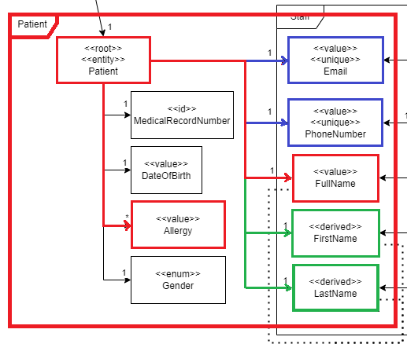
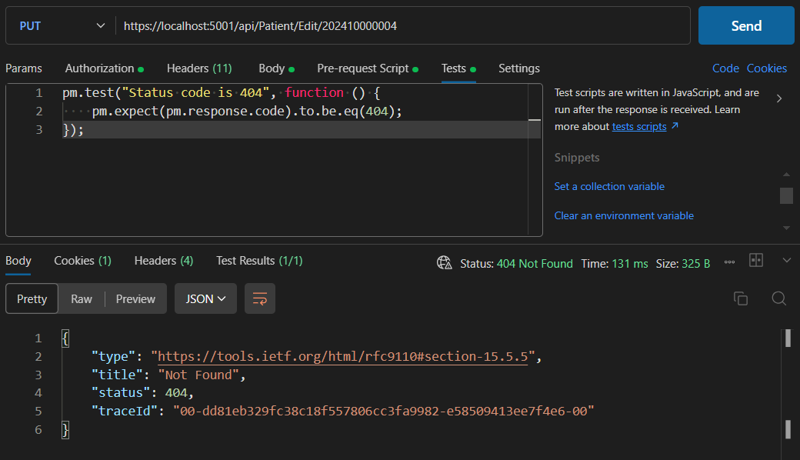
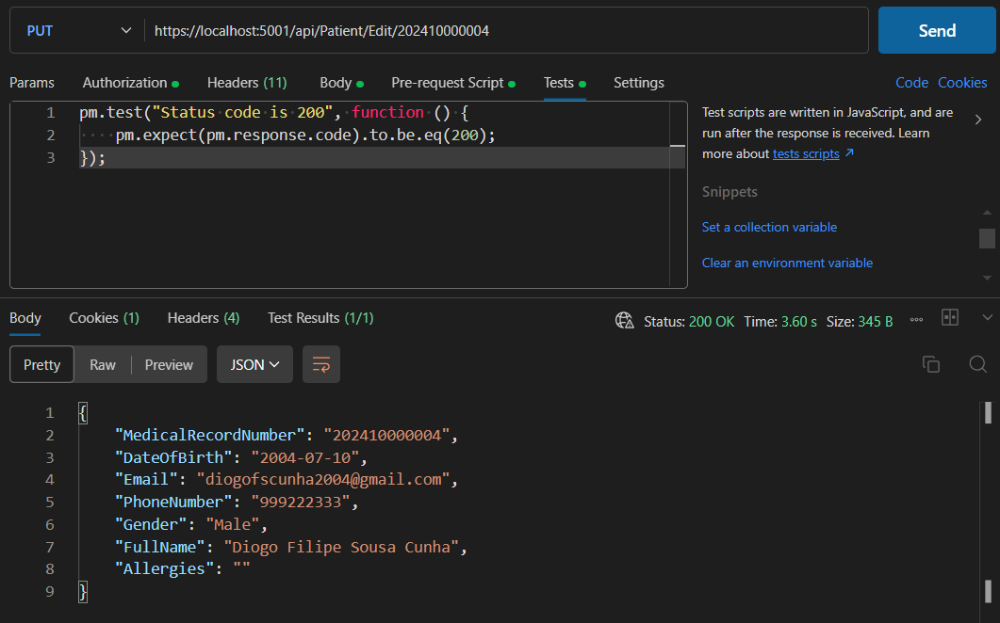
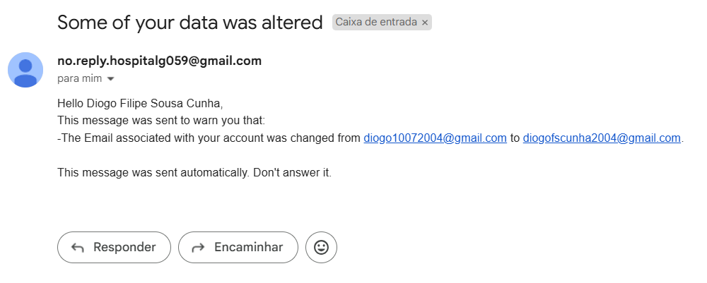

# US 9 - Edit an existing Patient Profile

As an **Admin**, I want to edit an existing patient profile, so that I can update their information when needed.

## 1. Context

This US is part of **Sprint A**, as part of the **Group of User Stories regarding patient profiles**.

## 2. Requirements

### 2.1. Acceptance Criteria

1. Admins can **search for** and **select** a patient profile to edit.
2. Editable fields include **name**, **contact information**, **medical history**, and **allergies**.
3. Changes to **sensitive data** (e.g., contact information) trigger an **email notification** to the patient.
4. The system **logs all profile changes** for auditing purposes.

### 2.2. Dependencies

This **US** depends on:
* [**US8**](../us8/readme.md) (Explained in **2.3. Pre-Conditions**).
* [**US11**](../us11/readme.md), since, from a usability point of view, this functionality starts from **Patient Profile Search**.


### 2.3. Pre-Conditions

For this **US** to work, there needs to be a **Patient Profile** inside the system, hence the dependency on [**US8**](../us8/readme.md).

### 2.4. Open Questions

* **Question 1:** Regarding the editing of patient information, is contact information the only sensitive data? Is it the only data that triggers an email notification?
    * **Answer 1:** faz parte das vossas responsabilidades no âmbito do módulo de proteçãod e dados e de acordo com a politica que venham a definir

* **Question 2:** In this US an admin can edit a user profile. Does the system display a list of all users or the admin searchs by ID? Or both?
    * **Answer 2:** this requirement is for the editing of the user profile. from a usability point of view, the user should be able to start this feature either by searching for a specific user or listing all users and selecting one.

        note that we are not doing the user interface of the system in this sprint.

* **Question 3:** When one of the contents that administrator edits is a sensitive content (eg. email), the notification is sent for what patient's email, the email in patient account, the old email of patient or the new email of patient?
    * **Answer 3:** if the email is changed, the notification should be sent to the "old" email

## 3. Analysis

The domain model includes everything that's needed in order to perform this *US* as intended.

The sections in red, in blue and in green show what is related to this *US*:
* The sections in [**blue**]() are sensitive values. If any of these are changed, a notification is sent to the **Patient**'s *Email*.
    * If the **Patient's Email** is changed, this notification is sent to the **old Email Address**, not to the **new one** (Due to **Question 3**).
* If the **Full Name** is changed, the **First Name** and the **Last Name** are changed automatically, hence the green color.



## 4. Design

The team decided that: 
* The **Patient Profile** to be edited should be specified by their **Medical Record Number**, since it's a unique identifier with actual domain meaning.
* The **Medical Record Number** should be sent through the URL.
* If the **Patient Profile** was successfully edited, the program should return a **DTO** with the data that was just deleted and an **Ok** Return Code.

## 5. C4 Views

The **C4 Views** for this *US* can be viewed [here](views/readme.md).

## 6. Tests

### 6.1. Unit Tests

#### PatientControllerTest

We tested the Controller with 2 scenarios:

1. Make sure that the Controller returns a **NotFound** message code when the requested **Patient Profile** doesn't exist.

    ```cs
    [Fact]
    public async Task EditPatient_ReturnsNotFoundWhenGettingNull() {
        // Setup mock to return Task with null when DeletePatient is called
        _mockService.Setup(s => s.EditPatient(It.IsAny<MedicalRecordNumber>(), 
            It.IsAny<FilterPatientDTO>())).Returns(Task.FromResult<PatientDTO>(null));

        // Act
        var result = await _controller.EditPatient("202410000004", SeedFilterPatientDTO()); //Random MedicalRecordNumber

        // Assert
        var actionResult = Assert.IsType<NotFoundResult>(result.Result);
    }
    ```

2. Make sure that the **Controller** returns an **Ok** message code and the **DTO** of the **Patient Profile** that was just edited otherwise.

    ```cs

    [Fact]
    public async Task EditPatient_ReturnsOkAndDTOWhenGettingDTO() {
        // Arrange
        var patientDto = SeedPatientDTO();
        
        // Setup mock to return the DTO when DeletePatient is called
        _mockService.Setup(s => s.EditPatient(It.IsAny<MedicalRecordNumber>(),
            It.IsAny<FilterPatientDTO>())).ReturnsAsync(patientDto);

        // Act
        var result = await _controller.EditPatient(patientDto.MedicalRecordNumber, SeedFilterPatientDTO());

        // Assert
        var actionResult = Assert.IsType<OkObjectResult>(result.Result);
        var returnValue = Assert.IsType<PatientDTO>(actionResult.Value);

        //DTO Content change is not tested here since that logic is in the Service
    }
    ```
    As the last comment in this code block says, the change in the DTO isn't tested here since that's not done by the **Controller**.

#### PatientServiceTest

We tested the Service with 3 scenarios:

1. Make sure that the Service returns **null** when the requested **Patient Profile** doesn't exist.

    ```cs
    [Fact]
    public async Task EditPatient_ReturnsNullWhenPatientDoesntExist() {
        // Setup mock to return Task with null when DeletePatient is called
        _mockPatRepo.Setup(r => r.GetPatientByRecordNumber(It.IsAny<MedicalRecordNumber>()))
            .Returns((Patient)null);

        // Act
        var result = await _service.EditPatient(new MedicalRecordNumber("202410000004"), SeedFilterPatientDTO()); //Random MedicalRecordNumber

        // Assert
        Assert.Null(result);
    }
    ```

2. Make sure that the **Service** returns the **DTO** of the **Patient Profile** that was just edited otherwise. (Changed values: **FullName** and **Allergies**)

    ```cs
    [Fact]
    public async Task EditPatient_ReturnsDTOWhenPatientExists() {
        var patientDto = SeedPatientDTO1();
        // Setup mock to return Task with null when DeletePatient is called
        _mockPatRepo.Setup(r => r.GetPatientByRecordNumber(It.IsAny<MedicalRecordNumber>()))
            .Returns(Patient.createFromDTO(patientDto));

        // Act
        var result = await _service.EditPatient(
                new MedicalRecordNumber(patientDto.MedicalRecordNumber), //Random MedicalRecordNumber
                SeedFilterPatientDTO()); 

        // Assert
        Assert.Equal(patientDto.Email, result.Email);
        Assert.Equal(patientDto.PhoneNumber, result.PhoneNumber);
        Assert.Equal(patientDto.DateOfBirth, result.DateOfBirth);
        Assert.NotEqual(patientDto.FullName, result.FullName);
        Assert.NotEqual(patientDto.Allergies, result.Allergies);
    }
    ```

3. Make sure that the **Service** returns the **DTO** of the **Patient Profile** that was just edited otherwise. (Changed values: **Email** and **PhoneNumber**)

    ```cs
    [Fact]
    public async Task EditPatient_ReturnsDTOWhenPatientExistsWithSensitiveData() {
        var patientDto = SeedPatientDTO1();
        // Setup mock to return Task with null when DeletePatient is called
        _mockPatRepo.Setup(r => r.GetPatientByRecordNumber(It.IsAny<MedicalRecordNumber>()))
            .Returns(Patient.createFromDTO(patientDto));

        // Act
        var result = await _service.EditPatient(
                new MedicalRecordNumber(patientDto.MedicalRecordNumber), //Random MedicalRecordNumber
                SeedFilterPatientDTOWithSensitiveData()); 

        // Assert
        Assert.NotEqual(patientDto.Email, result.Email);
        Assert.NotEqual(patientDto.PhoneNumber, result.PhoneNumber);
        Assert.Equal(patientDto.DateOfBirth, result.DateOfBirth);
        Assert.Equal(patientDto.FullName, result.FullName);
        Assert.Equal(patientDto.Allergies, result.Allergies);
        //The patient would receive a notification in their old email address, but the MessageSenderService is Mockd for this test
    }  
    ```
    As the last comment in this code block says, this would send a notification to the **Patient's Email Address**, but that isn't checked here since that's done by another component, the **IMessageSenderService**.

### 6.2. Integration Tests

First, we have to make sure that we can't edit a user that doesn't exist **(Exit Code = 404)**:



Then, we can show a case of an existing user being edited **(Exit Code = 200)**:



## 7. Implementation

### PatientController

The **PatientController** receives a **HttpPut** request and returns **NotFound()** if the **Patient Profile** doesn't exist. Otherwise it returns **Ok(pat)**.

```cs
[HttpPut("Edit/{id}")]
[Authorize(Roles = HospitalRoles.Admin)]
public async Task<ActionResult<PatientDTO>> EditPatient(string id, [FromBody] FilterPatientDTO dto) {
    try {
        var pat = await _service.EditPatient(new MedicalRecordNumber(id), dto);
        if (pat == null) return NotFound();
        return Ok(pat);
    }
    catch (BusinessRuleValidationException ex) {
        return BadRequest(new { ex.Message });
    }
}
```

### PatientService

Using the **MedicalRecordNumber**, the **PatientService** calls the repository to get the **patient** instance, changing the record according to what attributes exist in the received **FilterPatientDTO**.

```cs
public async virtual Task<PatientDTO> EditPatient(MedicalRecordNumber id, FilterPatientDTO dto){
    var patient = this._repository.GetPatientByRecordNumber(id);
    if (patient == null) return null;

    bool warn = false;
    string email = patient.Email.ToString();
    StringBuilder messageBuilder = new(string.Format("Hello {0},<br>This message was sent to warn you that:<br>", patient.FullName.Full)),
        logBuilder = new(string.Format("Edit in Patient {0}: ", id.Record));

    if (!string.IsNullOrEmpty(dto.FullName)){
        logBuilder.Append(string.Format("Full name changed from {0} to {1}, ", patient.FullName.Full, dto.FullName));
        patient.FullName = new FullName(dto.FullName);
    }

    if (!string.IsNullOrEmpty(dto.PhoneNumber)){
        warn = true;
        logBuilder.Append(string.Format("Phone Number changed from {0} to {1}, ", patient.PhoneNumber, dto.PhoneNumber));
        messageBuilder.Append(string.Format("-The Phone Number associated with your account was changed from {0} to {1}.<br>",patient.PhoneNumber,dto.PhoneNumber));
        patient.PhoneNumber = new PhoneNumber(dto.PhoneNumber);
    }
    if (!string.IsNullOrEmpty(dto.Email)){
        warn = true;
        logBuilder.Append(string.Format("Email changed from {0} to {1}, ", patient.Email, dto.Email));
        messageBuilder.Append(string.Format("-The Email associated with your account was changed from {0} to {1}.<br>",patient.Email,dto.Email));
        patient.Email = new MailAddress(dto.Email);
    }
    if (!string.IsNullOrEmpty(dto.Allergies)){
        logBuilder.Append(string.Format("Allergies changed from '{0}' to '{1}'", string.Join(", ", patient.Allergies.Select(a => a.allergyName)), dto.Allergies));
        patient.SetAllergies(dto.Allergies);
    }

    this._repository.Update(patient);
    await this._logRepository.AddAsync(new DomainLog(LogObjectType.Patient, LogActionType.Edit, logBuilder.ToString()));
    await this._unitOfWork.CommitAsync();

    if (warn){
        messageBuilder.Append("<br>This message was sent automatically. Don't answer it.<br>");
        _messageSender.SendMessage(email, "Some of your data was altered", messageBuilder.ToString());
    }

    return patient.returnDTO();
}
```

## 8. Demonstration

As this project doesn't have a **Frontend** yet, this section doesn't apply.

However, we can show the **message** that's sent.



This **message** shows every sensitive data that was changed.