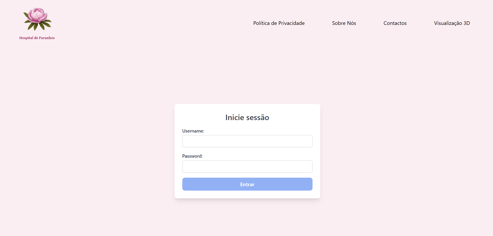

# US 6.1.1 - Create an UI

As **user**, I want to have an integrated UI for all modules of the system so that I don't need to switch between application urls.

## 1. Context

This **US** is part the center piece of the **Frontend module**.

## 2. Requirements

### 2.1. Acceptance Criteria

1. The user must be able to navigate the various functionalities without editing the URL manually (SPA).
2. The UI should still comply with good practices and use a web development framework (Angular, React, Vue, etc.).

### 2.2. Dependencies

No dependencies

### 2.3. Pre-Conditions

None

### 2.4. Open Questions

This **US** has no **Open Questions** yet.

## 3. Analysis

As specified by the **Acceptance Criteria**, the team should develop a Single Page Application that can communicate with the other modules, abiding to good practices and testing it with tools like **Jasmine** and **Cypress**.

## 4. Design

The team decided that:
* The UI will be done using the following tools:
    * **Angular** as the web development framework, as it's considered a safe and reliable framework with support by our teachers.
    * **Tailwind CSS** for the page's styling, as it's a sleak and simple tool that facilitates the page's development.
* The page's general appearance should match the icon created to represent our business:

    

* The UI should be in **Portuguese**.

## 5. Demonstration

This is the login page, as an example:

