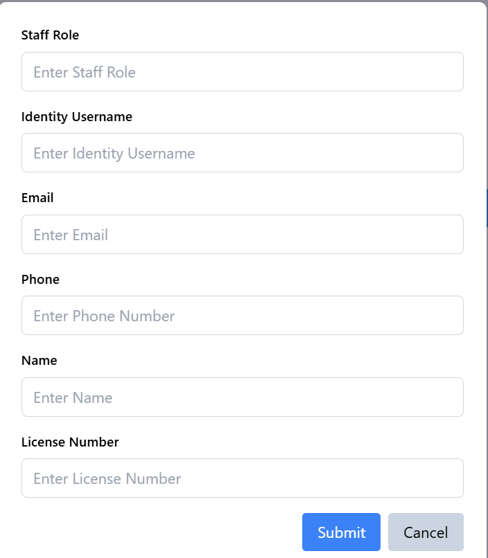

# US 6.2.10 - Request an staff.

As a **Admin**, I want to create a staff member.


## 1. Context

This **US** is part of the **Backoffice module**.

## 2. Requirements

### 2.1. Acceptance Criteria

1. Doctors can input staff details such as **Patient ID**, **staff type**, **Priority**, **Date**, **Time** and **Request Status**.
2. A unique **staff ID** is generated upon profile creation.
3. The system validates that the Patient ID and staff type are valid.
4. The profile is stored securely in the system.

### 2.2. Dependencies

This **US** has no **Dependencies**.

### 2.3. Pre-Conditions

None

### 2.4. Open Questions

This **US** has no **Open Questions** yet.

## 3. Analysis

This *US* is merely a *Frontend version* of another **US**, which contains the logic. Thus, this section does not apply here.

## 4. Design

The team decided that:
* The button to create an **staff** should be available before and after listing.
* After pressing button to create an **staff**, a small window should appear with the necessary data fields.
    * That window should enforce valid formats for fields like 'Patient ID' and 'staff Type'.
    * That window should have a "Save" button and a "Cancel" button.
    * After saving, the system should send a message saying:
        * The Opration was created successfully.
        * If it wasn't due to a Backend business rule violation (e.g. Patient ID was not valid), the message should explain what business rule was violated.

## 5. C4 Views

The **C4 Views** for this *US* can be viewed [here](views/readme.md).

## 6. Tests

* Test that the **staff** was successfully created.

**doctor.component.spec.ts**:
```ts
  describe('Form Initialization', () => {
    it('should initialize staffRequestForm with default values', () => {
      const form = component.staffRequestForm;
      expect(form.get('patientId')?.value).toBe('');
      expect(form.get('staffTypeId')?.value).toBe('');
      expect(form.get('priority')?.value).toBe(RequestPriority.Elective);
      expect(form.get('requestStatus')?.value).toBe(RequestStatus.Pending);
      expect(form.valid).toBeFalse();
    });
  });

  describe('CRUD staffs', () => {
    it('should call createstaffRequest and refresh the list on successful form submission', async () => {
      mockstaffRequestService.createstaffRequest.and.returnValue(Promise.resolve());
      mockstaffRequestService.getstaffRequests.and.returnValue(Promise.resolve([]));

      component.staffRequestForm.patchValue({
        patientId: '123',
        staffTypeId: '456',
        priority: RequestPriority.Elective,
        dateTime: '2023-12-01T12:00',
        requestStatus: RequestStatus.Pending,
      });

      await component.onSubmit();

      expect(mockstaffRequestService.createstaffRequest).toHaveBeenCalledWith(
        '123',
        '456',
        RequestPriority.Elective,
        '2023-12-01T12:00',
        RequestStatus.Pending
      );
      expect(mockstaffRequestService.getstaffRequests).toHaveBeenCalled();
      expect(component.showModal).toBeFalse();
    });

    it('should handle errors during createstaffRequest', async () => {
      mockstaffRequestService.createstaffRequest.and.returnValue(
        Promise.reject(new Error('Create failed'))
      );

      component.staffRequestForm.patchValue({
        patientId: '123',
        staffTypeId: '456',
        priority: RequestPriority.Elective,
        dateTime: '2023-12-01T12:00',
        requestStatus: RequestStatus.Pending,
      });

      await component.onSubmit();

      expect(component.formError).toBe(
        'Failed to create staff request. Please check your input and try again.'
      );
    });
```

## 7. Implementation

**doctor.component.html**

```html
<div *ngIf="showModal" class="modal fixed inset-0 flex items-center justify-center bg-gray-800 bg-opacity-50">
    <div class="modal-content bg-white p-6 rounded-lg shadow-lg max-w-lg w-full">
        <form [formGroup]="staffRequestForm" (ngSubmit)="onSubmit()">
            <div class="form-group mb-4">
                <label for="patientId" class="block text-sm font-semibold mb-2">Patient ID</label>
                <input id="patientId" formControlName="patientId" type="text" placeholder="Enter Patient ID" required
                    class="w-full px-3 py-2 border border-gray-300 rounded-md focus:ring-2 focus:ring-blue-500" />
                <div *ngIf="staffRequestForm.get('patientId')?.invalid && staffRequestForm.get('patientId')?.touched"
                    class="error text-red-500 text-sm mt-1">
                    Patient ID is required.
                </div>
            </div>
            <div class="form-group mb-4">
                <label for="staffTypeId" class="block text-sm font-semibold mb-2">staff Type</label>
                <input id="staffTypeId" formControlName="staffTypeId" type="text"
                    placeholder="Enter staff Type ID" required
                    class="w-full px-3 py-2 border border-gray-300 rounded-md focus:ring-2 focus:ring-blue-500" />
                <div *ngIf="staffRequestForm.get('staffTypeId')?.invalid && staffRequestForm.get('staffTypeId')?.touched"
                    class="error text-red-500 text-sm mt-1">
                    staff Type ID is required.
                </div>
            </div>
            <div class="form-group mb-4">
                <label for="priority" class="block text-sm font-semibold mb-2">Priority</label>
                <select id="priority" formControlName="priority" required
                    class="w-full px-3 py-2 border border-gray-300 rounded-md focus:ring-2 focus:ring-blue-500">
                    <option *ngFor="let priority of requestPriorityOptions" [value]="priority">{{ priority }}</option>
                </select>
                <div *ngIf="staffRequestForm.get('priority')?.invalid && staffRequestForm.get('priority')?.touched"
                    class="error text-red-500 text-sm mt-1">
                    Priority is required.
                </div>
            </div>
            <div class="form-group mb-4">
                <label for="dateTime" class="block text-sm font-semibold mb-2">Date and Time</label>
                <input id="dateTime" formControlName="dateTime" type="datetime-local" required
                    class="w-full px-3 py-2 border border-gray-300 rounded-md focus:ring-2 focus:ring-blue-500" />
                <div *ngIf="staffRequestForm.get('dateTime')?.invalid && staffRequestForm.get('dateTime')?.touched"
                    class="error text-red-500 text-sm mt-1">
                    Date and Time is required.
                </div>
            </div>
            <div class="form-group mb-4">
                <label for="requestStatus" class="block text-sm font-semibold mb-2">Request Status</label>
                <select id="requestStatus" formControlName="requestStatus" required
                    class="w-full px-3 py-2 border border-gray-300 rounded-md focus:ring-2 focus:ring-blue-500">
                    <option *ngFor="let status of requestStatusOptions" [value]="status">{{ status }}</option>
                </select>
                <div *ngIf="staffRequestForm.get('requestStatus')?.invalid && staffRequestForm.get('requestStatus')?.touched"
                    class="error text-red-500 text-sm mt-1">
                    Request Status is required.
                </div>
            </div>

            <div class="flex justify-end space-x-2 mt-4">
                <button type="submit" [disabled]="staffRequestForm.invalid"
                    class="px-4 py-2 bg-blue-500 text-white rounded hover:bg-blue-600 transition">Submit</button>
                <button type="button" (click)="closeModal()"
                    class="px-4 py-2 bg-slate-300 text-black rounded hover:bg-slate-600 transition">Cancel</button>
            </div>

            <div *ngIf="formError" class="error text-red-500 text-sm mt-2">
                {{ formError }}
            </div>
        </form>
    </div>
</div>
```

**doctor.component.ts**

```ts

  async createstaffRequest(): Promise<void> {
    this.showModal = true;
    this.formError = null;
  }

  async onSubmit(): Promise<void> {
    if (this.staffRequestForm.valid) {
      try {
        const {
          patientId,
          staffTypeId,
          priority,
          dateTime,
          requestStatus,
        } = this.staffRequestForm.value;
        await this.ors.createstaffRequest(
          patientId,
          staffTypeId,
          priority,
          dateTime,
          requestStatus
        );
        this.closeModal();
        this.liststaffRequests();
      } catch (error) {
        this.formError =
          'Failed to create staff request. Please check your input and try again.';
      }
    }
  }
```

## 8. Demonstration

This is the data form where the user can input the necessary information:

