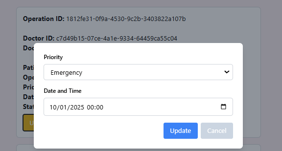

# US 6.2.15 - Update an operation requisition.

As a **Doctor**, I want to update an operation requisition, so that the Patient has access to the necessary healthcare.


## 1. Context

This **US** is part of the **Backoffice module**.

## 2. Requirements

### 2.1. Acceptance Criteria

1. Doctors can **search for an operation** to edit.
2. Editable fields include priority, date and time.
4. The system logs all profile changes for auditing purposes.

### 2.2. Dependencies

* [**US 6.2.17**](../../sprint-b/6-2-17/readme.md)

### 2.3. Pre-Conditions

For this **US** to work, there needs to be an **Operation** inside the system

### 2.4. Open Questions

This **US** has no **Open Questions** yet.

## 3. Analysis

This *US* is merely a *Frontend version* of another **US**, which contains the logic. Thus, this section does not apply here.

## 4. Design

The team decided the following aspects:
* The edit button should appear in every *Operation* from the list.
* The user should be able to pick what attributes they want to edit.
    * If they pick an attribute, its text box will unlock, allowing the user to enter the value they desire.
* After confirmation, the system should create a pop-up telling the user if the *Patient Profile* was successfully edited or not.

## 5. C4 Views

The **C4 Views** for this *US* can be viewed [here](views/readme.md).

## 6. Tests

* Test if edit occurs.
**doctor.component.spec.ts**:

```ts
    it('should update operation request and refresh the list', async () => {
      const mockRequest = { operationRequestId: '1', priority: 'High', dateTime: '2023-12-01T12:00' };
      mockOperationRequestService.updateOperationRequest.and.returnValue(Promise.resolve());
      mockOperationRequestService.getOperationRequests.and.returnValue(Promise.resolve([]));

      component.selectedRequest = mockRequest;
      component.updateRequestForm.patchValue({
        priority: 'Low',
        dateTime: '2023-12-05T12:00',
      });

      await component.onUpdateSubmit();

      expect(mockOperationRequestService.updateOperationRequest).toHaveBeenCalledWith(
        '1',
        'Low',
        '2023-12-05T12:00'
      );
      expect(mockOperationRequestService.getOperationRequests).toHaveBeenCalled();
    });
```

## 7. Implementation

**doctor.component.html**:

```html
<div *ngIf="showUpdateModal" class="modal fixed inset-0 flex items-center justify-center bg-gray-800 bg-opacity-50">
    <div class="modal-content bg-white p-6 rounded-lg shadow-lg max-w-lg w-full">
        <form [formGroup]="updateRequestForm" (ngSubmit)="onUpdateSubmit()">

            <div class="form-group mb-4">
                <label for="priority" class="block text-sm font-semibold mb-2">Priority</label>
                <select id="priority" formControlName="priority" required
                    class="w-full px-3 py-2 border border-gray-300 rounded-md focus:ring-2 focus:ring-blue-500">
                    <option *ngFor="let priority of requestPriorityOptions" [value]="priority">{{ priority }}</option>
                </select>
                <div *ngIf="updateRequestForm.get('priority')?.invalid && updateRequestForm.get('priority')?.touched"
                    class="error text-red-500 text-sm mt-1">
                    Priority is required.
                </div>
            </div>
            <div class="form-group mb-4">
                <label for="dateTime" class="block text-sm font-semibold mb-2">Date and Time</label>
                <input type="datetime-local" id="dateTime" formControlName="dateTime" required
                    class="w-full px-3 py-2 border border-gray-300 rounded-md focus:ring-2 focus:ring-blue-500" />
                <div *ngIf="updateRequestForm.get('dateTime')?.invalid && updateRequestForm.get('dateTime')?.touched"
                    class="error text-red-500 text-sm mt-1">
                    Date and Time is required.
                </div>
            </div>

            <div class="flex justify-end space-x-2 mt-4">
                <button type="submit" [disabled]="updateRequestForm.invalid"
                    class="px-4 py-2 bg-blue-500 text-white rounded hover:bg-blue-600 transition">Update</button>

                <button type="button" (click)="closeUpdateModal()"
                    class="px-4 py-2 bg-slate-300 text-white rounded hover:bg-slate-600 transition">Cancel</button>
            </div>

            <div *ngIf="formError" class="error text-red-500 text-sm mt-2">
                {{ formError }}
            </div>
        </form>
    </div>
</div>
```


**doctor.component.ts**:

```ts
  closeUpdateModal(): void {
    this.showUpdateModal = false;
    this.updateRequestForm.reset();
  }

  async updateOperationRequest(request: any): Promise<void> {
    this.selectedRequest = request;
    this.updateRequestForm.patchValue({
      priority: request.priority,
      dateTime: request.dateTime,
    });
    this.showUpdateModal = true;
  }

  async onUpdateSubmit(): Promise<void> {
    if (this.updateRequestForm.valid && this.selectedRequest) {
      try {
        const { priority, dateTime } = this.updateRequestForm.value;
        await this.ors.updateOperationRequest(
          this.selectedRequest.operationRequestId,
          priority,
          dateTime
        );
        this.updateSuccessMessage = `Operation request with ID ${this.selectedRequest.operationRequestId} was updated successfully.`;
        this.closeUpdateModal();
        this.listOperationRequests();

        setTimeout(() => {
          this.updateSuccessMessage = null;
        }, 3000);
      } catch (error) {
        console.error('Failed to update operation request:', error);
      }
    }
  }
```

## 8. Demonstration

This is the data form where the user can input the necessary information.

