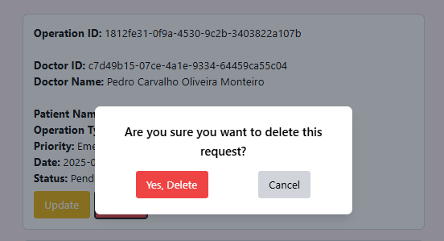

# US 6.2.16 - Remove an operation requisition.

As a **Doctor**, I want to remove an operation requisition, so that the healthcare activities are provided as necessary.


## 1. Context

This **US** is part of the **Backoffice module**.

## 2. Requirements

### 2.1. Acceptance Criteria

1. Doctors can **search for an operation** and mark it for deletion.
2. Before deletion, the system prompts the doctor to confirm the action.
3. Once deleted, all operation data is permanently removed from the system within a predefined time frame.
4. The system logs the deletion for audit and GDPR compliance purposes.

### 2.2. Dependencies

* [**US 6.2.17**](../../sprint-b/6-2-17/readme.md)

### 2.3. Pre-Conditions

For this **US** to work, there needs to be an **Operation** inside the system.

### 2.4. Open Questions

This **US** has no **Open Questions** yet.

## 3. Analysis

This *US* is merely a *Frontend version* of another **US**, which contains the logic. Thus, this section does not apply here.

## 4. Design

The team decided the following aspects:
* The delete button should appear in every *Operation* from the list.
* After confirmation, the system should create a pop-up telling the user if the *Operation* was successfully deleted or not.

## 5. C4 Views

The **C4 Views** for this *US* can be viewed [here](views/readme.md).

## 6. Tests

* Test if edit occurs.
**doctor.component.spec.ts**:

```ts
    it('should delete operation request and refresh the list', async () => {
      mockOperationRequestService.deleteOperationRequest.and.returnValue(Promise.resolve());
      mockOperationRequestService.getOperationRequests.and.returnValue(Promise.resolve([]));

      component.deleteOperationRequest('1');
      await component.confirmDelete();

      expect(mockOperationRequestService.deleteOperationRequest).toHaveBeenCalledWith('1');
      expect(mockOperationRequestService.getOperationRequests).toHaveBeenCalled();
    });
  });
```

## 7. Implementation

**doctor.component.html**:

```html
<div *ngIf="confirmingDelete" class="fixed inset-0 flex items-center justify-center bg-gray-800 bg-opacity-50">
    <div class="bg-white p-6 rounded-lg shadow-lg max-w-sm w-full">
        <p class="text-center text-lg font-semibold mb-4">Are you sure you want to delete this request?</p>
        <div class="flex justify-around">
            <button (click)="confirmDelete()"
                class="px-4 py-2 bg-red-500 text-white rounded hover:bg-red-600 transition">Yes, Delete</button>
            <button (click)="cancelDelete()"
                class="px-4 py-2 bg-gray-300 text-black rounded hover:bg-gray-400 transition">Cancel</button>
        </div>
    </div>
</div>
```


**doctor.component.ts**:

```ts
  deleteOperationRequest(requestId: string): void {
    this.requestIdToDelete = requestId;
    this.confirmingDelete = true;
  }

  async confirmDelete(): Promise<void> {
    if (this.requestIdToDelete) {
      try {
        await this.ors.deleteOperationRequest(this.requestIdToDelete);
        this.confirmingDelete = false;
        this.requestIdToDelete = null;
        this.listOperationRequests();
      } catch (error) {
        console.error('Failed to delete operation request:', error);
        this.confirmingDelete = false;
        this.requestIdToDelete = null;
      }
    }
  }

  cancelDelete(): void {
    this.confirmingDelete = false;
    this.requestIdToDelete = null;
  }
```

## 8. Demonstration

This is the confirmation window that appears when you select "Delete" on a Patient:

