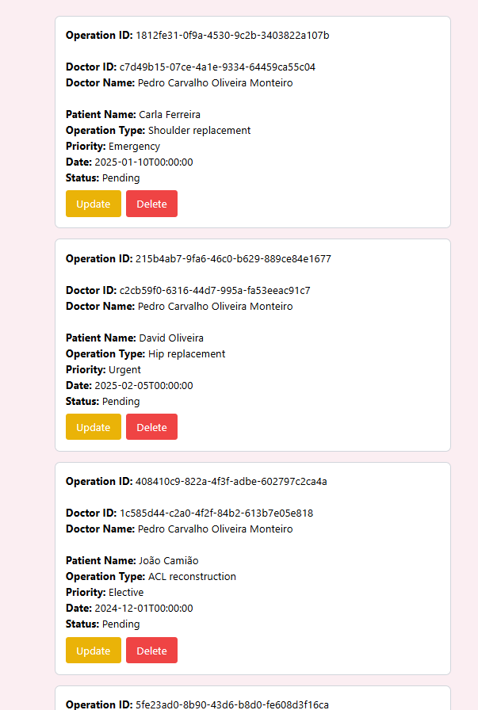

# US 6.2.17 - List/search operation requisitions.

As a **Doctor**, I want to list/search operation requisitions, so that I see the details, edit, and remove operation requisitions


## 1. Context

This **US** is part of the **Backoffice module**.

## 2. Requirements

### 2.1. Acceptance Criteria

1. Doctors can **search operations** fro some value.
2. The system displays search results in a list view with value entered.
3. Doctors can **select an operation from the list** to edit or delete the patient record.

### 2.2. Dependencies

This **US** has no **Dependencies**.

### 2.3. Pre-Conditions

For this **US** to work, there needs to be an **Operation** inside the system.

### 2.4. Open Questions

This **US** has no **Open Questions** yet.

## 3. Analysis

This *US* is merely a *Frontend version* of another **US**, which contains the logic. Thus, this section does not apply here.

## 4. Design

The team decided the following aspects:
* The user should be able to pick what value they want to filter by.
* If no operations are found with the picked conditions, a message should appear.
* Otherwise, each entry should:
    * Have their **Operation ID**, **Doctor ID**, **Doctor Name**, **Patient Name**, **Operation Type**, **Priority**, **Date**and **Status** shown when listed.
* If, when listing *Operations*, a change (a creation, an edit or a deletion) is made, the list should reload.

## 5. C4 Views

The **C4 Views** for this *US* can be viewed [here](views/readme.md).

## 6. Tests

* Test if edit occurs.
**doctor.component.spec.ts**:

```ts
  describe('Filtering', () => {
    it('should filter requests based on filterForm values', () => {
      component.operationRequests = [
        { patientName: 'John Doe', priority: 'High' },
        { patientName: 'Jane Smith', priority: 'Low' },
      ];

      component.filterForm.patchValue({
        filterCriteria: 'patientName',
        filterValue: 'Jane',
      });

      component.filterRequests();
      expect(component.filteredRequests).toEqual([{ patientName: 'Jane Smith', priority: 'Low' }]);
    });
  });
});
```

## 7. Implementation

**doctor.component.html**:

```html
<!-- List -->
<div *ngIf="filteredRequests.length > 0" class="request-list mt-4 mx-auto max-w-4xl px-4">
    <ul class="space-y-4">
        <li *ngFor="let request of filteredRequests"
            class="request-item p-4 w-full sm:w-[600px] mx-auto border border-gray-300 rounded-lg bg-white hover:bg-gray-50">
            <div><strong>Operation ID:</strong> {{ request.operationRequestId }}</div>
            <br>
            <div><strong>Doctor ID:</strong> {{ request.patientId }}</div>
            <div><strong>Doctor Name:</strong> {{ request.doctorName }}</div>
            <br>
            <div><strong>Patient Name:</strong> {{ request.patientFullName }}</div>
            <div><strong>Operation Type:</strong> {{ request.operationTypeName }}</div>
            <div><strong>Priority:</strong> {{ request.priority }}</div>
            <div><strong>Date:</strong> {{ request.dateTime }}</div>
            <div><strong>Status:</strong> {{ request.requestStatus }}</div>
            <div class="mt-2 flex space-x-2">
                <button (click)="updateOperationRequest(request)"
                    class="px-4 py-2 bg-yellow-500 text-white rounded hover:bg-yellow-600 transition">Update</button>
                <button (click)="deleteOperationRequest(request.operationRequestId)"
                    class="px-4 py-2 bg-red-500 text-white rounded hover:bg-red-600 transition">Delete</button>
            </div>
        </li>
    </ul>
</div>

<div *ngIf="updateSuccessMessage"
    class="bg-green-100 border border-green-400 text-green-700 px-4 py-3 rounded mb-4 w-full max-w-md text-center">
    {{ updateSuccessMessage }}
</div>

<div *ngIf="notFound" class="text-center text-red-500 font-semibold text-lg mt-4">
    No Operation Requests Found.
</div>
```


**doctor.component.ts**:

```ts
  async listOperationRequests(): Promise<void> {
    try {
      this.operationRequests = await this.ors.getOperationRequests();
      this.filteredRequests = [...this.operationRequests];
      this.notFound = this.filteredRequests.length === 0;
      console.log('Fetched Operation Requests:', this.operationRequests);
    } catch (error) {
      console.error('Error fetching operation requests:', error);
    }
  }

  filterRequests(): void {
    const { filterCriteria, filterValue } = this.filterForm.value;

    this.filteredRequests = this.operationRequests.filter((request) => {
      const value = request[filterCriteria]?.toString().toLowerCase();
      return value.includes(filterValue.toLowerCase());
    });
  }
}
```

## 8. Demonstration

This is the data form where the user can input the necessary information.

