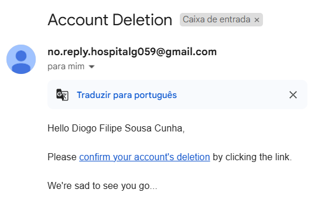

# US 6.2.6 - Delete account as Patient

As an **Patient**, I want to delete my account and all associated data, so that I can exercise my right to be forgotten as per GDPR.

## 1. Context

This **US** is the *Frontend* version of [**US 5.1.5**](../../sprint-a/us5/readme.md).

## 2. Requirements

### 2.1. Acceptance Criteria

1. Patients can request to delete their account through the profile settings.
2. The system sends a confirmation email to the patient before proceeding with account deletion.
3. Upon confirmation, all personal data is permanently deleted from the system within the legally required time frame (e.g., 30 days).
4. Patients are notified once the deletion is complete, and the system logs the action for GDPR compliance.
5. Some anonymized data may be retained for legal or research purposes, but all identifiable information is erased.

### 2.2. Dependencies

This **US** depends on:
* [**US 5.1.5**](../../sprint-a/us5/readme.md), since this functionality calls the *Web API* request to delete the profile.

### 2.3. Pre-Conditions

The user must have an account.

### 2.4. Open Questions

This **US** has no **Open Questions** yet.

## 3. Analysis

This *US* is merely a *Frontend version* of another **US**, which contains the logic. Thus, this section does not apply here.

## 4. Design

The team decided that:
* The button to delete the account should be available when the patient logs in.
* After pressing button, a confirmation window should appear.
  * After confirming, the Backend functionality should be called and a notification should appear on the screen telling the user that an email was sent.

## 5. Implementation

**patient.component.html**:

```html
<button
    (click)="onDeleteProfileClick()"
    class="bg-red-600 text-white px-4 py-2 rounded-lg hover:bg-red-700 focus:outline-none focus:ring-2 focus:ring-red-400 focus:ring-offset-2 transition"
    >
    Eliminar Perfil
    </button>
  
    <!-- Modal de confirmação -->
    <div
      *ngIf="showConfirmation"
      class="fixed inset-0 bg-black bg-opacity-50 flex items-center justify-center"
    >
      <div class="bg-white rounded-lg shadow-lg p-6 w-96">
        <h2 class="text-lg font-semibold text-gray-800">Confirmação</h2>
        <p class="text-gray-600 mt-4">
          Tem certeza de que deseja eliminar o seu perfil? Esta ação não pode ser desfeita.
        </p>
        <div class="mt-6 flex justify-end space-x-4">
          <button
            (click)="cancelDelete()"
            class="px-4 py-2 bg-gray-300 rounded-lg hover:bg-gray-400 transition"
          >
            Cancelar
          </button>
          <button
            (click)="confirmDelete()"
            class="px-4 py-2 bg-red-600 text-white rounded-lg hover:bg-red-700 transition"
          >
            Confirmar
          </button>
        </div>
      </div>
    </div>

    <!-- Feedback Message -->
<div *ngIf="showNotification" [class]="messageClass + ' fixed top-4 right-4 p-3 rounded shadow-lg'">
    {{ messageText }}
  </div>
```

**patient.component.ts**:
```ts
  onDeleteProfileClick(): void {
    this.showConfirmation = true;
  }
  cancelDelete(): void {
    this.showConfirmation = false;
  }

  async confirmDelete(): Promise<void> {
    try {
      const response = await this.service.deleteAccount(this.token);

      this.showNotification = true;
      if (response) {
        this.messageText = "Um link de confirmação foi enviado para o seu email";
        this.messageClass = 'bg-green-500 text-white';
      }
      
    } catch (error) {
      console.error("Erro ao eliminar conta:", error);
      this.showNotification = true;
      this.messageText = 'Erro ao eliminar conta. Tente novamente.';
      this.messageClass = 'bg-red-500 text-white';
    } finally {
      this.showConfirmation = false;

      setTimeout(() => {
        this.showNotification = false;
      }, 3000);
    }
  }
```

**patient-user-service.ts**:

```ts
  async deleteAccount(token: string | null): Promise<HttpResponse<any>> {
    if (!token) throw new Error("Token is required");
    const headers = new HttpHeaders({
      'Authorization': `Bearer ${token}`,
      'Content-Type': 'application/json'
    });
    const response = await lastValueFrom(this.http.delete<any>(`${this.apiPath}/Auth/DeleteProfile/`, { headers, observe: 'response' }));
    return response;
  }
```

## 6. Demonstration

This is the confirmation window:


Success message example:


Email:



Error message example:

