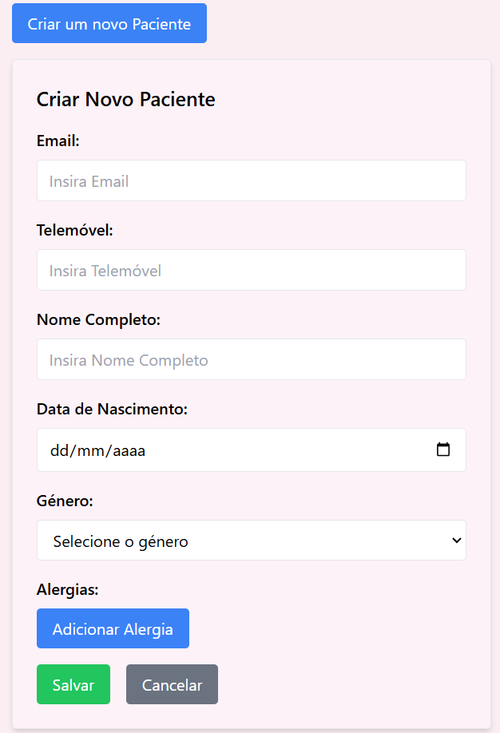
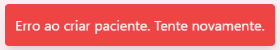

# US 6.2.6 - Create a Patient Profile

As an **Admin**, I want to create a new patient profile, so that I can register their personal details and medical history.

## 1. Context

This **US** is the *Frontend* version of [**US 5.1.8**](../../sprint-a/us8/readme.md).

## 2. Requirements

### 2.1. Acceptance Criteria

1. Admins can input patient details such as **first name**, **last name**, **date of birth**, **contact information** and **medical history**.
2. A unique **patient ID (Medical Record Number)** is generated upon profile creation.
3. The system validates that the patient's email and phone number are unique.
4. The profile is stored securely in the system, and access is governed by role-based permissions.

### 2.2. Dependencies

This **US** depends on:
* [**US 5.1.8**](../../sprint-a/us8/readme.md), since this functionality calls the *Web API* request to create a *Patient Profile*.
* [**US 6.2.9**](../6-2-9/readme.md), since the user has to list *Patient Profiles* in order to select one to edit.

### 2.3. Pre-Conditions

None

### 2.4. Open Questions

This **US** has no **Open Questions** yet.

## 3. Analysis

This *US* is merely a *Frontend version* of another **US**, which contains the logic. Thus, this section does not apply here.

## 4. Design

The team decided that:
* The button to create a **Patient Profile** should be available before and after listing.
* After pressing button to create a **Patient Profile**, a small window should appear with the necessary data fields.
    * That window should enforce valid formats for fields like 'Email' and 'PhoneNumber'.
    * That window should have a "Save" button and a "Cancel" button.
    * After saving, the system should send a message saying:
        * The Patient was created successfully.
        * If it wasn't due to a Backend business rule violation (e.g. Email wasn't unique), the message should explain what business rule was violated.

## 5. C4 Views

The **C4 Views** for this *US* can be viewed [here](views/readme.md).

## 6. Tests

* Test that the **Patient** was successfully created.

**patient-management.component.spec.ts**:
```ts
  describe('Creation', () => {
    it('should successfully create a patient', async () => {
      const createAttributes: PatientCreateAttributes = {
        Email: 'test@example.com',
        PhoneNumber: '123456789',
        FullName: 'Test User',
        DateOfBirth: '2000-01-01',
        Gender: 'Male',
        Allergies: 'Peanuts, Shellfish',
      };
      let mockResponse: HttpResponse<Patient> = new HttpResponse();
      mockPatientService.createPatient.and.returnValue(Promise.resolve(mockResponse));
      
      component.createFields['Email'].value = createAttributes.Email;
      component.createFields['PhoneNumber'].value = createAttributes.PhoneNumber;
      component.createFields['FullName'].value = createAttributes.FullName;
      component.createFields['DateOfBirth'].value = 
      typeof createAttributes.DateOfBirth === 'string' 
        ? createAttributes.DateOfBirth 
        : createAttributes.DateOfBirth.toISOString(); // Or use any preferred date format
          component.createFields['Gender'].value = createAttributes.Gender;
      component.allergiesList = ['Peanuts', 'Shellfish'];

      await component.onCreate();

      expect(component.messageText).toContain('criado com sucesso!');
      expect(component.messageClass).toContain('bg-green-500');
    });
  })
```

**patient-service.spec.ts**:
```ts
  it('should create a new patient locally', () => {
    const token = 'test-token';
    const newPatient: PatientCreateAttributes = { 
      FullName: 'Patient 3', 
      Email: 'patient3@example.com', 
      PhoneNumber: '932923093', 
      Allergies: 'Gatos', 
      DateOfBirth: new Date('20041010'),
      Gender: "Male" 
    };
  
    const mockPatient: Patient = {
      MedicalRecordNumber: '202411000001',
      FullName: 'Patient 3', 
      Email: 'patient3@example.com', 
      PhoneNumber: '932923093', 
      Allergies: 'Gatos', 
      DateOfBirth: new Date('20041010'),
      Gender: "Male" 
    };
  
    service.createPatient(token, newPatient).then((response) => {
        expect(response.body).toEqual(mockPatient);
    });
  
    const req = httpMock.expectOne(`${path}/Patient/Create`);
    expect(req.request.method).toBe('POST');
    expect(req.request.headers.get('Authorization')).toBe(`Bearer ${token}`);
    req.flush(mockPatient);  // Use mockPatient instead of wrapping in HttpResponse
  });
```

## 7. Implementation

**patient-management.component.html**:

```html
<!-- Botão para iniciar criação de novo paciente (sempre visível) -->
<button
  (click)="startCreate()"
  class="mb-4 px-4 py-2 bg-blue-500 text-white rounded hover:bg-blue-600 transition"
>
  Criar um novo Paciente
</button>

<!-- Formulário de criação de paciente, visível apenas se isCreating for true -->
<div *ngIf="isCreating" class="p-6 bg-pink-50 border rounded shadow-md space-y-4">
  <h2 class="text-xl font-semibold">Criar Novo Paciente</h2>

  <!-- Loop para criar campos de entrada baseados nos atributos -->
  <div *ngFor="let attr of creatingAttributes" class="space-y-2">
    <label [for]="attr.key" class="block font-medium">{{ attr.label }}:</label>
    
    <!-- Campo de texto padrão para Nome Completo -->
    <input
      *ngIf="attr.key == 'FullName'"
      [(ngModel)]="createFields[attr.key].value"
      [name]="attr.key"
      required
      class="w-full px-3 py-2 border rounded"
      placeholder="Insira {{ attr.label }}"
    />

    <!-- Campo de texto padrão para Email -->
    <input
      *ngIf="attr.key === 'Email'"
      [(ngModel)]="createFields[attr.key].value"
      [name]="attr.key"
      type="email"
      required
      class="w-full px-3 py-2 border rounded"
      placeholder="Insira {{ attr.label }}"
      pattern="^[a-zA-Z0-9._%+-]+@[a-zA-Z0-9.-]+\.[a-zA-Z]{2,}$"
      title="Por favor, insira um email válido."
    />

    <!-- Campo de texto padrão para Telemóvel -->
    <input
      *ngIf="attr.key === 'PhoneNumber'"
      [(ngModel)]="createFields[attr.key].value"
      [name]="attr.key"
      type="tel"
      required
      class="w-full px-3 py-2 border rounded"
      placeholder="Insira {{ attr.label }}"
      pattern="^\d{9}$"
      title="Por favor, insira um número de telemóvel com 9 dígitos."
    />   

    <!-- Campo de data para Data de Nascimento -->
    <input
      *ngIf="attr.key === 'DateOfBirth'"
      [(ngModel)]="createFields[attr.key].value"
      [name]="attr.key"
      type="date"
      required
      class="w-full px-3 py-2 border rounded"
    />

    <!-- Select para o campo Gênero -->
    <select
      *ngIf="attr.key === 'Gender'"
      [(ngModel)]="createFields[attr.key].value"
      [name]="attr.key"
      required
      class="w-full px-3 py-2 border rounded"
    >
      <option value="" disabled selected>Selecione o género</option>
      <option value="Male">Masculino</option>
      <option value="Female">Feminino</option>
      <option value="Other">Outro</option>
    </select>
  </div>

  <!-- Campo para lista de Alergias -->
  <div class="space-y-2">
    <label class="block font-medium">Alergias:</label>
    <!-- Itera pela lista de alergias e exibe uma caixa de texto para cada alergia -->
    <div *ngFor="let allergy of allergiesList; let i = index; trackBy: trackByIndex" class="flex items-center space-x-2 mb-1">
      <input
        [(ngModel)]="allergiesList[i]"
        name="allergy{{ i }}"
        class="px-3 py-2 border rounded w-full"
        placeholder="Insira uma alergia"
      />
      <button type="button" (click)="removeAllergy(i)" class="px-2 bg-red-500 text-white rounded">Remover</button>
    </div>
    <!-- Botão para adicionar nova alergia -->
    <button type="button" (click)="addAllergy()" class="mt-2 px-4 py-2 bg-blue-500 text-white rounded">
      Adicionar Alergia
    </button>
  </div>

  <!-- Botões de ação para salvar ou cancelar a criação do paciente -->
  <div class="flex space-x-4 mt-4">
    <button type="button" (click)="onCreate()" class="px-4 py-2 bg-green-500 text-white rounded hover:bg-green-600 transition">
      Salvar
    </button>
    <button type="button" (click)="cancelCreate()" class="px-4 py-2 bg-gray-500 text-white rounded hover:bg-gray-600 transition">
      Cancelar
    </button>
  </div>
</div>
```

**patient-management.component.ts**:
```ts
  async onCreate(): Promise<void> {
    const createParams: PatientCreateAttributes = {Email: '',PhoneNumber: '',FullName: '',DateOfBirth: '',Gender: '',Allergies: ''};
    for (const [key, field] of Object.entries(this.createFields)) {
      if (key === 'Allergies') {
        createParams[key as keyof PatientCreateAttributes] = this.allergiesList.join(', ');
      } else {
        console.log(field.value);
        createParams[key as keyof PatientCreateAttributes] = field.value;
      }
    }
    try{
      const response = await this.patientService.createPatient(this.token, createParams);
      this.showMessage = true;
      if (response) {
        this.messageText = `Paciente ${response.body?.MedicalRecordNumber} criado com sucesso!`;
        this.messageClass = 'bg-green-500 text-white';
      }
      
    } catch (error) {
      console.error("Erro ao criar paciente:", error);
      this.showMessage = true;
      this.messageText = 'Erro ao criar paciente. Tente novamente.';
      this.messageClass = 'bg-red-500 text-white';
    } finally {
      this.isEditing = false;
      this.selectedItem = null;
      await this.loadPatients();

      setTimeout(() => {
        this.showMessage = false;
      }, 3000);
    }
  }
```

**patient-service.ts**:

```ts
  async createPatient(token: string | null, attributes: PatientCreateAttributes): Promise<HttpResponse<Patient>> {
    if (!token) throw new Error("Token is required");
    const headers = new HttpHeaders({
      'Authorization': `Bearer ${token}`,
      'Content-Type': 'application/json'
    });
    const body = Object.fromEntries(
      Object.entries(attributes).filter(([_, value]) => value != null) // Remove properties with null or undefined values
    );
    console.log(body);
    const patient = await lastValueFrom(this.http.post<Patient>(`${this.apiPath}/Patient/Create`, body, {headers, observe: 'response'}));
    return patient;
  }
```

## 8. Demonstration

This is the data form where the user can input the necessary information:



Success message example:


Error message example:

