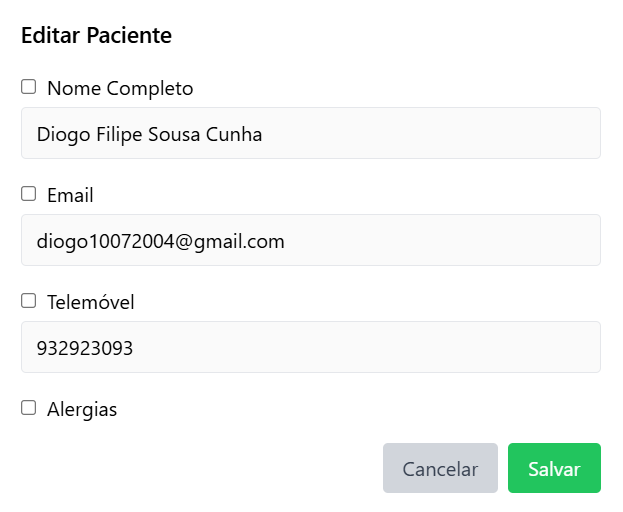
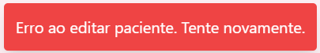

# US 6.2.7 - Edit a Patient Profile

As an **Admin**, I want to edit a patient profile, so that I can update their information when needed.

## 1. Context

This **US** is the *Frontend* version of [**US 5.1.9**](../../sprint-a/us9/readme.md).

## 2. Requirements

### 2.1. Acceptance Criteria

1. Admins can **search for a patient profile** to edit.
2. Editable fields include name, contact information, medical history, and allergies.
3. Changes to sensitive data (e.g., contact information) trigger an email notification to the patient.
4. The system logs all profile changes for auditing purposes.

### 2.2. Dependencies

This **US** depends on:
* [**US 5.1.9**](../../sprint-a/us9/readme.md), since this functionality calls the *Web API* request to edit a *Patient Profile*.
* [**US 6.2.9**](../6-2-9/readme.md), since the user has to list *Patient Profiles* in order to select one to edit.

### 2.3. Pre-Conditions

For this **US** to work, there needs to be a **Patient Profile** inside the system ([**US 5.1.8**](../../sprint-a/us8/readme.md)).

### 2.4. Open Questions

This **US** has no **Open Questions** yet.

## 3. Analysis

This *US* is merely a *Frontend version* of another **US**, which contains the logic. Thus, this section does not apply here.

## 4. Design

The team decided the following aspects:
* The edit button shouldn't appear until the user has clicked on a specific *Patient Profile* from the list.
* The user should be able to pick what attributes they want to edit.
    * If they pick an attribute, its text box will unlock, allowing the user to enter the value they desire.
    * The 'Allergies' attribute should be a list of strings. Thus, it should have a small button to add an allergy and a button to remove an allergy.
* After confirmation, the system should create a pop-up telling the user if the *Patient Profile* was successfully edited or not.
    * If the edit failed due to a business rule violation, the message should tell the user what rule was violated (e.g., Email is not unique)

## 5. C4 Views

The **C4 Views** for this *US* can be viewed [here](views/readme.md).

## 6. Tests

* Test if edit occurs.
**patient-management.component.spec.ts**:

```ts
it('should successfully edit a patient', async () => {
    const editAttributes: PatientEditAttributes = {
    Email: 'test@example.com',
    FullName: 'Test User',
    };
    let mockResponse: HttpResponse<Patient> = new HttpResponse();
    mockPatientService.editPatient.and.returnValue(Promise.resolve(mockResponse));
    
    if(editAttributes.Email != undefined) component.editingFields['Email'].value = editAttributes.Email;
    if(editAttributes.FullName != undefined) component.editingFields['FullName'].value = editAttributes.FullName;
    
    await component.submitEdit(patient);

    expect(component.messageText).toContain('editado com sucesso!');
    expect(component.messageClass).toContain('bg-green-500');
});
```

**patient-service.spec.ts**:

```ts
  it('should edit an existing patient', async () => {
    const token = 'test-token';
    const MedicalRecordNumber = '202411000001';
    const attributes: PatientEditAttributes = { 
      Email: 'newemail@example.com', 
      Allergies: 'Peanuts' 
    };
  
    const mockPatient: Patient = {
      MedicalRecordNumber: MedicalRecordNumber,
      FullName: 'Test Edit',
      Email: 'newemail@example.com',
      PhoneNumber: '912834756',
      Allergies: 'Peanuts',
      DateOfBirth: new Date('20041010'),
      Gender: 'Male'
    };
  
    service.editPatient(token, MedicalRecordNumber, attributes).then((response) => {
      expect(response.body).toEqual(mockPatient);
    });
  
    const req = httpMock.expectOne(`${path}/Patient/Edit/${MedicalRecordNumber}`);
    expect(req.request.method).toBe('PATCH');
    expect(req.request.headers.get('Authorization')).toBe(`Bearer ${token}`);
    req.flush(mockPatient);
  });
```

* Test if edit can't work on a *Patient Profile* that doesn't exist.

**patient-management.component.spec.ts**:

```ts
it('shouldnt edit non existent patient', async () => {
    const editAttributes: PatientEditAttributes = {
    Email: 'test@example.com',
    FullName: 'Test User',
    };
    let mockResponse: HttpResponse<Patient> = new HttpResponse();
    mockPatientService.editPatient.and.returnValue(Promise.resolve(mockResponse));
    
    if(editAttributes.Email != undefined) component.editingFields['Email'].value = editAttributes.Email;
    if(editAttributes.FullName != undefined) component.editingFields['FullName'].value = editAttributes.FullName;
    
    await component.submitEdit(null);

    expect(component.messageText).toBe('');
    expect(component.messageClass).toBe('');
    //"patient does not exist" was logged 
});
```

## 7. Implementation

**patient-management.component.html**:

```html
    <div *ngIf="isEditing" class="fixed inset-0 flex items-center justify-center bg-gray-800 bg-opacity-50">
      <div class="bg-white p-6 rounded-lg shadow-lg max-w-lg w-full">
        <h2 class="text-lg font-semibold mb-4">Editar Paciente</h2>
        
        <form (ngSubmit)="submitEdit(selectedItem)">
          <div *ngFor="let attr of editableAttributes" class="mb-4">
            <label class="flex items-center space-x-2">
              <input
                type="checkbox"
                [(ngModel)]="editingFields[attr.key].selected"
                name="{{attr.key}}Selected"
              />
              <span>{{ attr.label }}</span>
            </label>
    
            <!-- Input for Editable Fields -->
            <div *ngIf="attr.key !== 'Allergies'; else allergiesInput">
              <input
                [(ngModel)]="editingFields[attr.key].value"
                name="{{attr.key}}Value"
                class="mt-1 px-3 py-2 border rounded w-full"
                placeholder="Insira o {{attr.label}}"
                [disabled]="!editingFields[attr.key].selected"
              />
            </div>
    
            <!-- Special Handling for Allergies List -->
            <ng-template #allergiesInput>
              <div *ngIf="editingFields['Allergies'].selected">
                <div *ngFor="let allergy of allergiesList; let i = index; trackBy: trackByIndex" class="flex items-center space-x-2 mb-1">
                  <input
                    [(ngModel)]="allergiesList[i]"
                    name="allergy{{i}}"
                    class="px-3 py-2 border rounded w-full"
                    placeholder="Insira uma alergia"
                  />
                  <button type="button" (click)="removeAllergy(i)" class="px-2 bg-red-500 text-white rounded">
                    Remover
                  </button>
                </div>
                <button type="button" (click)="addAllergy()" class="mt-2 px-4 py-2 bg-blue-500 text-white rounded">
                  Adicionar Alergia
                </button>
              </div>
            </ng-template>
          </div>
    
          <div class="flex justify-end space-x-2 mt-4">
            <button type="button" (click)="cancelEdit()" class="px-4 py-2 bg-gray-300 text-gray-700 rounded hover:bg-gray-400">
              Cancelar
            </button>
            <button type="submit" class="px-4 py-2 bg-green-500 text-white rounded hover:bg-green-600">
              Salvar
            </button>
          </div>
        </form>
      </div>
    </div> 
```

**patient-management.component.ts**:

```ts
  // Start editing a patient
  onEdit(patient: Patient): void {
    this.selectedItem = { ...patient };
    this.isEditing = true;
    
    this.editableAttributes.forEach((attr) => {
      const value = patient[attr.key] || '';
      this.editingFields[attr.key].value = value;
      
      // Initialize allergies list from comma-separated string
      if (attr.key === 'Allergies') {
        this.allergiesList = value ? value.split(',').map((item: string) => item.trim()) : [];
      }
    });
  }
```

```ts
  // Submit edits to the service
  async submitEdit(patient: Patient | null): Promise<void> {
    const editParams: PatientEditAttributes = {};

    // Loop through each field, adding only selected fields
    for (const [key, field] of Object.entries(this.editingFields)) {
      if (field.selected) {
        // Handle allergies field as comma-separated string
        if (key === 'Allergies') {
          editParams[key as keyof PatientEditAttributes] = this.allergiesList.join(', ');
        } else {
          editParams[key as keyof PatientEditAttributes] = field.value;
        }
      }
    }

    if (patient) {
      try {
        const response = await this.patientService.editPatient(this.token, patient.MedicalRecordNumber, editParams);

        this.showMessage = true;
        if (response) {
          this.messageText = `Paciente ${response.body?.MedicalRecordNumber} editado com sucesso!`;
          this.messageClass = 'bg-green-500 text-white';
        }
      } catch (error) {
        console.error("Erro ao editar paciente:", error);
        this.showMessage = true;
        this.messageText = 'Erro ao editar paciente. Tente novamente.';
        this.messageClass = 'bg-red-500 text-white';
      } finally {
        this.isEditing = false;
        this.selectedItem = null;
        await this.loadPatients();

        setTimeout(() => {
          this.showMessage = false;
        }, 3000);
      }
    } else {
      console.error("O Paciente não existe.");
    }
  }
```

**patient-service.ts**:

```ts
  async editPatient(token: string | null, MedicalRecordNumber: string, attributes: PatientEditAttributes): Promise<HttpResponse<Patient>> {
    if (!token) throw new Error("Token is required");
    const headers = new HttpHeaders({
      'Authorization': `Bearer ${token}`,
      'Content-Type': 'application/json'
    });
    const body = Object.fromEntries(
      Object.entries(attributes).filter(([_, value]) => value != null) // Remove properties with null or undefined values
    );
    const patient = await lastValueFrom(this.http.patch<Patient>(`${this.apiPath}/Patient/Edit/${MedicalRecordNumber}`, body, { headers, observe: 'response' }));
    return patient;
  }
```

## 8. Demonstration

This is the data form where the user can input the necessary information.

As specified in the 'Design' section, we can choose what attributes we actually want to choose:



Success message example:


Error message example:

