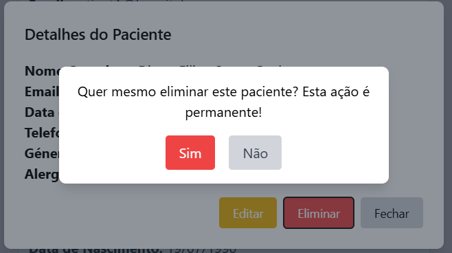
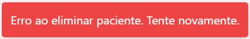

# US 6.2.8 - Delete a Patient Profile

As an **Admin**, I want to delete a patient profile, so that I can remove patients who are no longer under care.

## 1. Context

This **US** is the *Frontend* version of [**US 5.1.10**](../../sprint-a/us10/readme.md).

## 2. Requirements

### 2.1. Acceptance Criteria

1. Admins can **search for a patient profile** and mark it for deletion.
2. Before deletion, the system prompts the admin to confirm the action.
3. Once deleted, all patient data is permanently removed from the system within a predefined time frame.
4. The system logs the deletion for audit and GDPR compliance purposes.

### 2.2. Dependencies

This **US** depends on:
* [**US 5.1.10**](../../sprint-a/us10/readme.md), since this functionality calls the *Web API* request to delete a *Patient Profile*.
* [**US 6.2.9**](../6-2-9/readme.md), since the user has to list *Patient Profiles* in order to select one to delete.

### 2.3. Pre-Conditions

For this **US** to work, there needs to be a **Patient Profile** inside the system ([**US 5.1.8**](../../sprint-a/us8/readme.md)).

### 2.4. Open Questions

This **US** has no **Open Questions** yet.

## 3. Analysis

This *US* is merely a *Frontend version* of another **US**, which contains the logic. Thus, this section does not apply here.

## 4. Design

The team decided the following aspects:
* The delete button shouldn't appear until the user has clicked on a specific *Patient Profile* from the list.
* After confirmation, the system should create a pop-up telling the user if the *Patient Profile* was successfully deleted or not.

## 5. C4 Views

The **C4 Views** for this *US* can be viewed [here](views/readme.md).

## 6. Tests

* Test if deletion occurs.
**patient-management.component.spec.ts**:

```ts
it('should successfully delete a patient', async () => {
    let mockResponse: HttpResponse<Patient> = new HttpResponse();
    mockPatientService.deletePatient.and.returnValue(Promise.resolve(mockResponse));
    
    await component.onDelete(patient);

    expect(component.messageText).toContain('eliminado com sucesso!');
    expect(component.messageClass).toContain('bg-green-500');
});
```

**patient-service.spec.ts**:

```ts
  it('should delete a patient', async () => {
    const token = 'test-token';
    const MedicalRecordNumber = '202411000001';
    const mockPatient: Patient = {
      MedicalRecordNumber: MedicalRecordNumber,
      FullName: 'Test Edit',
      Email: 'newemail@example.com',
      PhoneNumber: '912834756',
      Allergies: 'Peanuts',
      DateOfBirth: new Date('20041010'),
      Gender: 'Male'
    };
  
    service.deletePatient(token, MedicalRecordNumber).then((response) => {
      expect(response.body).toEqual(mockPatient);
    });
  
    const req = httpMock.expectOne(`${path}/Patient/Delete/${MedicalRecordNumber}`);
    expect(req.request.method).toBe('DELETE');
    expect(req.request.headers.get('Authorization')).toBe(`Bearer ${token}`);
    req.flush(mockPatient);
  });
```

* Test if deletion can't work on a *Patient Profile* that doesn't exist.
**patient-management.component.spec.ts**:

```ts
it('shouldnt delete non existent patient', async () => {
    let mockResponse: HttpResponse<Patient> = new HttpResponse();
    mockPatientService.deletePatient.and.returnValue(Promise.resolve(mockResponse));
    
    await component.onDelete(null);

    expect(component.messageText).toBe('');
    expect(component.messageClass).toBe('');
    //"patient does not exist" was logged 
});
```

## 7. Implementation

**patient-management.component.html**:

```html
<div *ngIf="confirmingDelete" class="fixed inset-0 flex items-center justify-center bg-gray-800 bg-opacity-50">
  <div class="bg-white p-4 rounded-lg shadow-lg max-w-sm w-full">
    <p class="text-center">Quer mesmo eliminar este paciente? Esta ação é permanente!</p>
    <div class="flex justify-center space-x-4 mt-4">
      <button (click)="onDelete(selectedItem)" class="px-4 py-2 bg-red-500 text-white rounded hover:bg-red-600">
        Sim
      </button>
      <button (click)="cancelDelete()" class="px-4 py-2 bg-gray-300 text-gray-700 rounded hover:bg-gray-400">
        Não
      </button>
    </div>
  </div>
</div>
```

**patient-management.component.ts**:

```ts
  async onDelete(patient: Patient | null): Promise<void> {
    if (patient) {
      try {
        const response = await this.patientService.deletePatient(this.token, patient.MedicalRecordNumber);
  
        this.showMessage = true;
        if (response) {
          this.messageText = `Paciente ${response.body?.MedicalRecordNumber} eliminado com sucesso!`;
          this.messageClass = 'bg-green-500 text-white';
        }
        
      } catch (error) {
        console.error("Erro ao eliminar paciente:", error);
        this.showMessage = true;
        this.messageText = 'Erro ao eliminar paciente. Tente novamente.';
        this.messageClass = 'bg-red-500 text-white';
      } finally {
        this.confirmingDelete = false;
        this.selectedItem = null;
        await this.loadPatients();
  
        setTimeout(() => {
          this.showMessage = false;
        }, 3000);
      }
    } else {
      console.error("O Paciente não existe.");
    }
  }
```

**patient-service.ts**:

```ts
  async deletePatient(token: string | null, MedicalRecordNumber: string): Promise<HttpResponse<Patient>> {
    if (!token) throw new Error("Token is required");
    const headers = new HttpHeaders({
      'Authorization': `Bearer ${token}`,
      'Content-Type': 'application/json'
    });
    const patient = await lastValueFrom(this.http.delete<Patient>(`${this.apiPath}/Patient/Delete/${MedicalRecordNumber}`, { headers, observe: 'response' }));
    return patient;
  }
```

## 8. Demonstration

This is the confirmation window that appears when you select "Delete" on a Patient:



Success message example:


Error message example:

