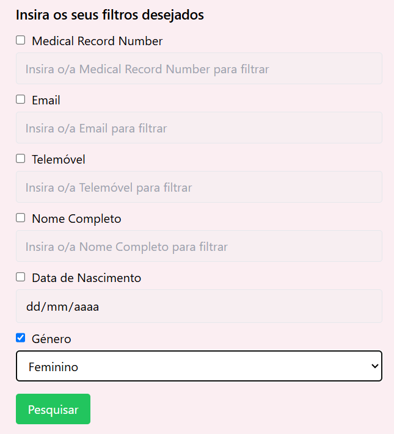
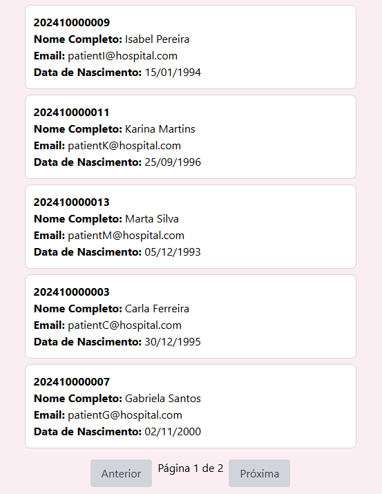
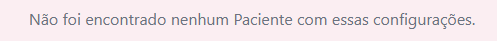

# US 6.2.9 - List/Search Patient Profiles

As an **Admin**, I want to list/search patient profiles by different attributes, so that I can view the details, edit, and remove patient profiles.

## 1. Context

This **US** is the *Frontend* version of [**US 5.1.11**](../../sprint-a/us11/readme.md).

## 2. Requirements

### 2.1. Acceptance Criteria

1. Admins can **search patient profiles** by various attributes, including **name**, **email**, **date of birth**, or **medical record number**.
2. The system displays search results in a list view with key patient information (name, email, date of birth).
3. Admins can **select a profile from the list** to view, edit or delete the patient record.
4. The search results are **paginated**, and filters are available to refine the search results.

### 2.2. Dependencies

This **US** depends on:
* [**US 5.1.8**](../../sprint-a/us8/readme.md) (Explained in **2.3. Pre-Conditions**).
* [**US 5.1.11**](../../sprint-a/us11/readme.md), since this functionality calls the *Web API* request to search and filter *Patient Profiles*.

### 2.3. Pre-Conditions

For this **US** to work, there needs to be a **Patient Profile** inside the system, hence the dependency on [**US 5.1.8**](../../sprint-a/us8/readme.md).

### 2.4. Open Questions

This **US** has no **Open Questions** yet.

## 3. Analysis

This *US* is merely a *Frontend version* of another **US**, which contains the logic. Thus, this section does not apply here.

## 4. Design

The team decided the following aspects:
* The user should be able to pick what attributes they want to filter by.
    * If they pick an attribute, its text box will unlock, allowing the user to enter the value they desire.
* If no patients are found with the picked conditions, a message should appear.
* Otherwise, each entry should:
    * Have their **Medical Record Number**, **Full Name**, **Email** and **Date of Birth** shown when listed.
    * After picking one, it should additionally show the other attributes of that **Patient** and show an **Edit button** and a **Delete button**.
* Each page should display **5 Patients**.
* If, when listing *Patient Profiles*, a change (a creation, an edit or a deletion) is made, the list should reload.

## 5. C4 Views

The **C4 Views** for this *US* can be viewed [here](views/readme.md).

## 6. Tests

* Test if list appears.
**patient-management.component.spec.ts**:

```ts
it('should successfully list patients', async () => {
    const searchAttributes: PatientSearchAttributes = {
    Email: 'test@example.com',
    FullName: 'Test User',
    };
    let mockResponse: HttpResponse<Patient[]> = new HttpResponse({body:[patient]});
    mockPatientService.getPatients.and.returnValue(Promise.resolve(mockResponse));
    
    if(searchAttributes.Email != undefined) component.searchFields['Email'].value = searchAttributes.Email;
    if(searchAttributes.FullName != undefined) component.searchFields['FullName'].value = searchAttributes.FullName;
    
    await component.loadPatients();
    
    if(mockResponse.body != null) expect(component.patients).toBe(mockResponse.body);
    else fail();
});
```

**patient-service.spec.ts**:

```ts
  it('should retrieve patients list', async () => {
    const at : PatientSearchAttributes = {FullName: 'John Doe'}; 
    const token = 'test-token';
    const mockResponse: Patient[] = [
      { MedicalRecordNumber: '202411000001', FullName: 'John Doe', Email: 'teste1@gmail.com', PhoneNumber: '912834756', Gender: 'Male', Allergies: 'Gatos', DateOfBirth: new Date('20041010') },
      { MedicalRecordNumber: '202411000002', FullName: 'John Doe', Email: 'teste2@gmail.com', PhoneNumber: '921843765', Gender: 'Male', Allergies: 'Fungos', DateOfBirth: new Date('20041111') },
    ];

    service.getPatients(token, at).then((patients) => {
      expect(patients.body).toEqual(mockResponse);
    });

    const req = httpMock.expectOne(`${path}/Patient/Search`);
    expect(req.request.method).toBe('POST');
    expect(req.request.headers.get('Authorization')).toBe(`Bearer ${token}`);
    expect(req.request.body).toEqual(at);
    req.flush(mockResponse);
  });
```

* Test if empty list makes a message appear.
**patient-management.component.spec.ts**:

```ts
it('should display empty list message', async () => {
    const searchAttributes: PatientSearchAttributes = {
    Email: 'test@example.com',
    FullName: 'Test User',
    };
    let mockResponse: HttpResponse<Patient[]> = new HttpResponse();
    mockPatientService.getPatients.and.returnValue(Promise.resolve(mockResponse));
    
    if(searchAttributes.Email != undefined) component.searchFields['Email'].value = searchAttributes.Email;
    if(searchAttributes.FullName != undefined) component.searchFields['FullName'].value = searchAttributes.FullName;
    
    await component.loadPatients();

    expect(component.patients.length).toBe(0);
});
```

## 7. Implementation

**patient-management.component.html**:

Before Search:

```html
<!-- Initial Search Fields Before Listing Patients -->
  <div *ngIf="!isInitialized" class="mb-4">
    <h2 class="text-lg font-semibold mb-2">Insira os seus filtros desejados</h2>
    <form (ngSubmit)="onInitialize()">
      <!-- Loop through each attribute to display checkboxes and locked input fields -->
      <div *ngFor="let attribute of searchableAttributes" class="mb-2">
        <label class="flex items-center space-x-2">
          <input
            type="checkbox"
            [(ngModel)]="searchFields[attribute.key].selected"
            name="{{attribute.key}}Selected"
          />
          <span>{{ attribute.label }}</span>
        </label>

        <!-- Gender select box -->
        <ng-container *ngIf="attribute.key === 'Gender'; else standardInput">
          <select
            [(ngModel)]="searchFields['Gender'].value"
            name="GenderValue"
            class="mt-1 px-3 py-2 border rounded w-full"
            [disabled]="!searchFields['Gender'].selected"
          >
            <option value="" disabled selected hidden>Selecione Género</option>
            <option value="Male">Masculino</option>
            <option value="Female">Feminino</option>
            <option value="Others">Outros</option>
          </select>
        </ng-container>

        <!-- Date picker for DateOfBirth -->
        <ng-template #standardInput>
          <input
            *ngIf="attribute.key === 'DateOfBirth'; else textInput"
            type="date"
            [(ngModel)]="searchFields['DateOfBirth'].value"
            name="DateOfBirthValue"
            class="mt-1 px-3 py-2 border rounded w-full"
            [disabled]="!searchFields['DateOfBirth'].selected"
          />
        </ng-template>

        <!-- Standard text input for other fields -->
        <ng-template #textInput>
          <input
            [(ngModel)]="searchFields[attribute.key].value"
            name="{{attribute.key}}Value"
            class="mt-1 px-3 py-2 border rounded w-full"
            placeholder="Insira o/a {{attribute.label}} para filtrar"
            [disabled]="!searchFields[attribute.key].selected"
          />
        </ng-template>
      </div>

      <button
        type="submit"
        class="mt-2 px-4 py-2 bg-green-500 text-white rounded hover:bg-green-600"
      >
        Pesquisar
      </button>
    </form>
  </div>
```

After Search:

```html
    <div *ngIf="patients.length === 0" class="text-center text-gray-500">
      <p>Não foi encontrado nenhum Paciente com essas configurações.</p>
    </div>

    <!-- Patient list and pagination controls (only if patients exist) -->
    <div *ngIf="patients.length > 0">
      <!-- List of patients -->
      <ul class="space-y-2">
        <li
          *ngFor="let patient of paginatedPatients"
          class="p-3 border rounded-lg cursor-pointer bg-white border-gray-300 hover:bg-gray-100 transition"
          (click)="onSelect(patient)"
        >
          <div>
            <strong>{{ patient.MedicalRecordNumber }}</strong> <br />
            <span><strong>Nome Completo:</strong> {{ patient.FullName }}</span> <br />
            <span><strong>Email:</strong> {{ patient.Email }}</span> <br />
            <span><strong>Data de Nascimento:</strong> {{ patient.DateOfBirth | date: 'dd/MM/yyyy' }}</span>
          </div>
        </li>
      </ul>
```

**patient-management.component.ts**:

```ts
  async loadPatients(): Promise<void> {
    this.patients = [];
    // Construct search parameters based on selected search fields
    const searchParams: PatientSearchAttributes = {};

    for (const [key, field] of Object.entries(this.searchFields)) {
      if (field.selected && field.value) {
        searchParams[key as keyof PatientSearchAttributes] = field.value;
      }
    }

    try {
      // Pass searchParams to getPatients to filter results
      const response = await this.patientService.getPatients(this.token, searchParams);
      const patients = response.body;
      console.log(response.status);

      if (patients && patients.length > 0) {
        this.patients = patients;
        this.updatePagination();
      } else {
        this.patients = [];
        console.log("No patients found.");
      }
    } catch (error) {
      console.error("Failed to load patients:", error);
    }
  }
```

**patient-service.ts**:

```ts
  async getPatients(token: string | null, searchableAttributes: PatientSearchAttributes) : Promise<HttpResponse<Patient[]>> {
    if (!token) throw new Error("Token is required");
    const headers = new HttpHeaders({
      'Authorization': `Bearer ${token}`,
      'Content-Type': 'application/json'
    });

    const body = Object.fromEntries(
        Object.entries(searchableAttributes).filter(([_, value]) => value != null) // Remove properties with null or undefined values
    );

    const patients = await lastValueFrom(
        this.http.post<Patient[]>(`${this.apiPath}/Patient/Search`, body, { headers, observe: 'response' })
      );
    return patients;
  }
```

## 8. Demonstration

This is the data form where the user can input the necessary information.

As specified in the 'Design' section, we can choose what attributes we actually want to filter by:



List example:



Empty list message example:

