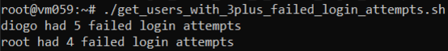

# US 6.4.8 - Implement a backup strategy

As **system administrator**, I want to get users with more than 3 incorrect accesses attempts.

## 1. Context

This **US** is part of the **Business Continuity module**.

## 2. Requirements

### 2.1. Acceptance Criteria

1. The system must show to the *admin* a list of users that have more than 3 incorrect login attempts.

### 2.2. Dependencies

None

### 2.3. Pre-Conditions

None

### 2.4. Open Questions

No open questions

## 3. Analysis

Through analysis of the requisites, we can conclude that we must develop a script that returns users that have more than 3 incorrect login attempt.

In order to do this, we must access the records in **/var/log/auth.log** and check for failed attempts.

## 4. Design

The team decided that:
* The script should be named: **get_users_with_3plus_failed_login_attempts.sh**.
* The result should be printed to the screen. If the user wants to redirect the output to a file, they can do so using a **pipe**.
* Each line should be structured like this:
    * *user* had *number* failed login attempts

## 5. Implementation

The implementation and the code explanation will be explained more in depth in its section on the [report](../6-4-1/report.pdf).  

## 6. Demonstration

