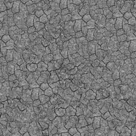
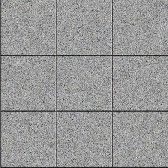
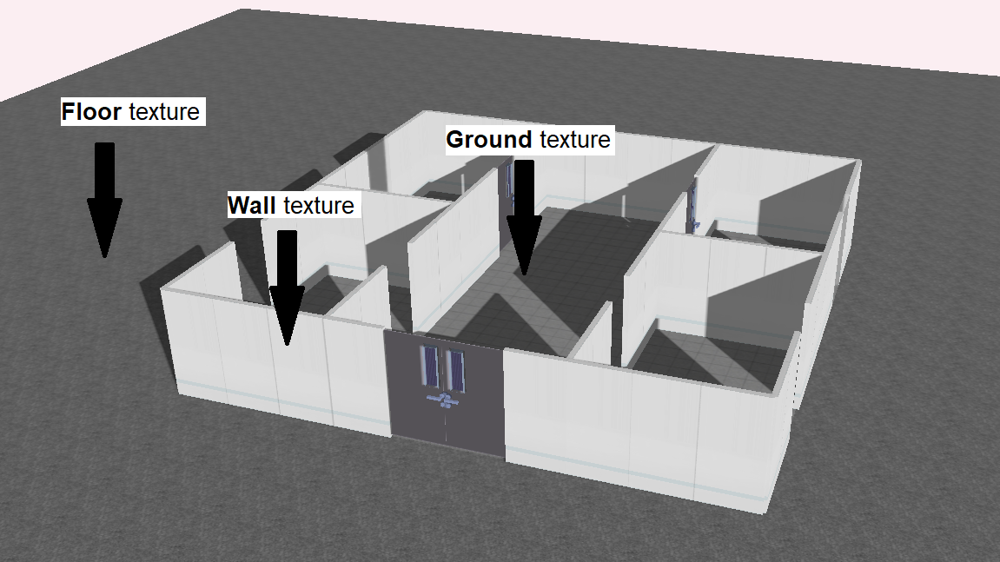

# US 6.5.2 - Apply textures to the 3D Visualization

As a **healthcare staff member**, I want to see appropriate textures (that is, suitable for use in representing a hospital or clinic) mapped onto the floor, walls and so on.

## 1. Context

This **US** is part of the **3D visualization module**.

## 2. Requirements

### 2.1. Acceptance Criteria

1. There mustn't be any objects without textures.
2. Textures must be suitable for use in representing a hospital or clinic.

### 2.2. Dependencies

This **US** depends on:
* [**US 6.5.1**](../6-5-1/readme.md), since the textures must be mapped into the structure built in that functionality.

### 2.3. Pre-Conditions

* The textures must be mapped onto the hospital structure, thus is must exist beforehand.

### 2.4. Open Questions

* No Open Questions

## 3. Analysis

Through the requisites, we can conclude that:
* The textures chosen must be hospital-appropriate.
* The textures must be mapped in a way that makes sense.

## 4. Design

The team chose the following textures:

**Ground Texture**



**Hospital Floor Texture**



**Hospital Wall Texture**


## 5. Implementation

This is written in our **config.json** file.

```json
"groundTextureUrl": "./ground.jfif",
"floorTextureUrl": "./floor.png",
"wallTextureUrl": "./wall.jpg",
```

Which, in turn, is called by:
* Wall
 ```js
export default class Wall {
    constructor(parameters) {
        ...

        // Create a texture
        const texture = new THREE.TextureLoader().load(this.textureUrl);
        texture.colorSpace = THREE.SRGBColorSpace;
        
        texture.wrapS = THREE.RepeatWrapping;
        texture.wrapT = THREE.ClampToEdgeWrapping;
        texture.repeat.set(this.size.width, this.size.height);
        texture.magFilter = THREE.LinearFilter;
        texture.minFilter = THREE.LinearFilter;

        ...
        
        const material = new THREE.MeshStandardMaterial({ map: texture });
        this.object = new THREE.Mesh(geometry, material);
        ...
    }
}
 ```

* Ground (with the Ground texture) / Floor (with the Floor texture)

```js
export default class Ground {
    constructor(parameters) {
        ...

        const texture = new THREE.TextureLoader().load(this.textureUrl);
        texture.colorSpace = THREE.SRGBColorSpace;
        
        texture.wrapS = THREE.RepeatWrapping;
        texture.wrapT = THREE.RepeatWrapping;
        texture.repeat.set(this.size.width, this.size.height);
        texture.magFilter = THREE.LinearFilter;
        texture.minFilter = THREE.LinearMipmapLinearFilter;

        ...
        
        const material = new THREE.MeshStandardMaterial({ map: texture, side:THREE.DoubleSide });
        this.object = new THREE.Mesh(geometry, material);
        ...
    }
}
```

## 8. Demonstration

This is how it looks in action:

