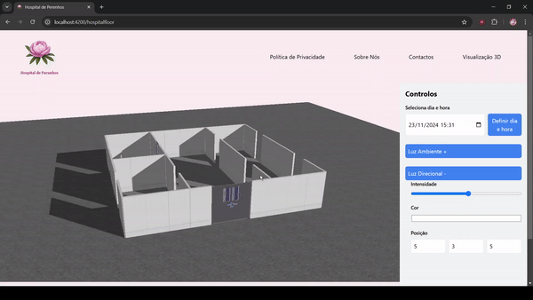

# US 6.5.4 - Control the Camera

As a **healthcare staff member**, I want to control the camera with the mouse.

Controls can either be created or imported (e.g., three.js addon OrbitControls or equivalent):
* Left button: unused for now. It will be defined in the next sprint
* Right button: orbit
* Wheel: Zoom or dolly

## 1. Context

This **US** is part of the **3D visualization module**.

## 2. Requirements

### 2.1. Acceptance Criteria

1. The user must be able to control the camera using their moused the way it was specified previously.

### 2.2. Dependencies

* No dependencies (explained in **2.3. Pre-Conditions**).

### 2.3. Pre-Conditions

* Although the camera will be centered on the **Hospital floor** created in [**US 6-5-1**](../6-5-1/readme.md), it can be easily set up using a template object.

### 2.4. Open Questions

* No Open Questions

## 3. Analysis

Not applicable here, as this functionality has no business logic.

## 4. Design

The team decided that:
* The Camera controls will be imported (and modified) from OrbitControls.

## 5. C4 Views

-

## 6. Tests

* Test if the camera is correctly set up.
```ts
  it('should correctly set up the camera and OrbitControls', () => {
    const controls = new OrbitControls(mockCamera, mockRenderer.domElement);
    controls.target.set( 0, 0, 0 );
    controls.maxDistance = 40;
    controls.minDistance = 5;

    expect(controls.target.x).toBe(0);
    expect(controls.target.y).toBe(0);
    expect(controls.target.z).toBe(0);

    expect(controls.maxDistance).toBe(40);
    expect(controls.minDistance).toBe(5);
  });
```
* Test if the right button and wheel function as intended.
```ts
  it('should configure the right mouse button for rotation and the middle button for dolly', () => {
    const controls = new OrbitControls(mockCamera, mockRenderer.domElement);
    controls.mouseButtons = {
      MIDDLE: THREE.MOUSE.DOLLY,
      RIGHT: THREE.MOUSE.ROTATE,
    };

    expect(controls.mouseButtons.MIDDLE).toBe(THREE.MOUSE.DOLLY);
    expect(controls.mouseButtons.RIGHT).toBe(THREE.MOUSE.ROTATE);
  });
```

## 7. Implementation

**hospitalfloor.component.ts**

```ts
const controls = new OrbitControls(this.camera, this.renderer.domElement);
controls.mouseButtons = {
    //LEFT will be defined in the next sprint
    MIDDLE: THREE.MOUSE.DOLLY,
    RIGHT: THREE.MOUSE.ROTATE
};
controls.target.set( 0, 0, 0 );
controls.maxDistance = 40;
controls.minDistance = 5;
```

As stated in the **Design** section, the Camera controls were imported and modified as needed from **OrbitControls**.

## 8. Demonstration

