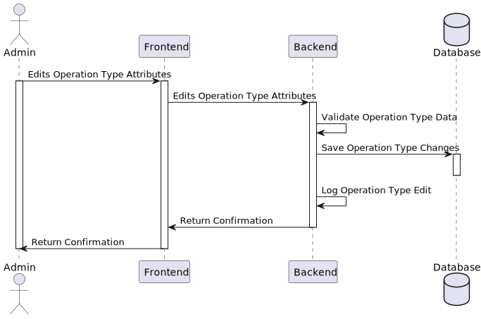
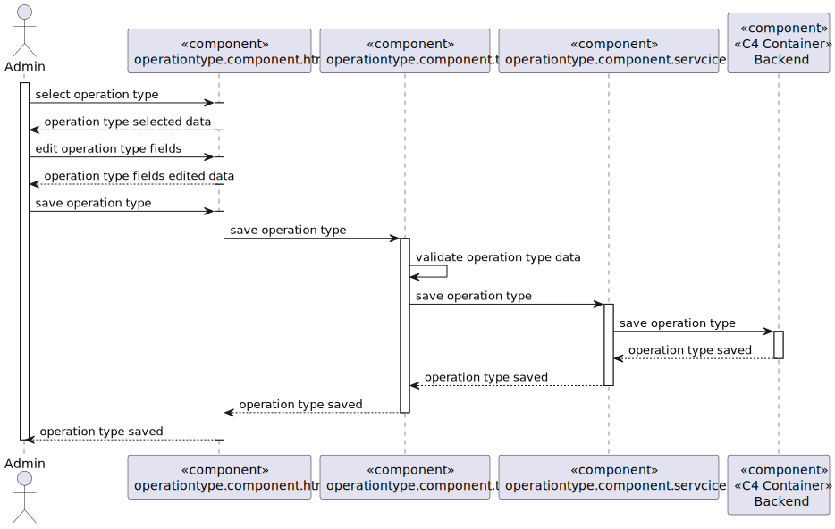

# 6.2.19 - Edit Operation Type

As an Admin, I want to edit existing operation types, so that I can update or correct information about the procedure. (UI for US 5.1.21).

## 1. Context

This US is the *Frontend* version of [**US 5.1.21**](../../sprint-a/us21/readme.md).

## 2. Requirements

### 2.1. Acceptance Criteria

1. Admins can **search for and select an existing operation type** to edit.
2. Editable fields include **operation name, required staff by specialization, and estimated duration**.
3. Changes are reflected in the system **immediately for future** operation requests.
4. Historical data is **maintained**, but new operation requests will use the updated operation type information.

### 2.2. Dependencies

This **US** depends on:
* [**US 5.1.23**] since this functionality calls the *Web API* request to search and edit **Operation Types**.
* [**US 5.1.21**] since this functionality calls the *Web API* request to edit **Operation Types**.
* [**US 5.1.20**] since this functionality calls there needs to be  **Operation Types**.

### 2.3. Pre-Conditions

For this **US** to work, there needs to be **Operation Types** inside the system, hence the dependency on [**US 5.1.20**].

### 2.4. Open Questions

This **US** has no **Open Questions** yet.

## 3. Analysis

This *US* is the *Frontend version* of another **US**, which contains the logic. Thus, this section does not apply here.

## 4. Design

The team decided the following aspects:

* The user should be able to search for an existing operation type.
* The user should be able to edit the Operation Name, Required Staff by Specialization, and Estimated Duration.
* The system should validate that the attributes are correctly filled.
* After editing the Operation Type, the system should log the changes and make them available for scheduling immediately.

## 5. C4 Views

### Level 1

### Level 2

### Level 3

## 6. Tests

-

## 7. Implementation

-

## 8. Demonstration

-
