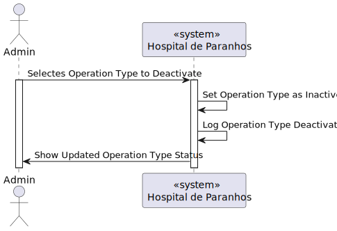
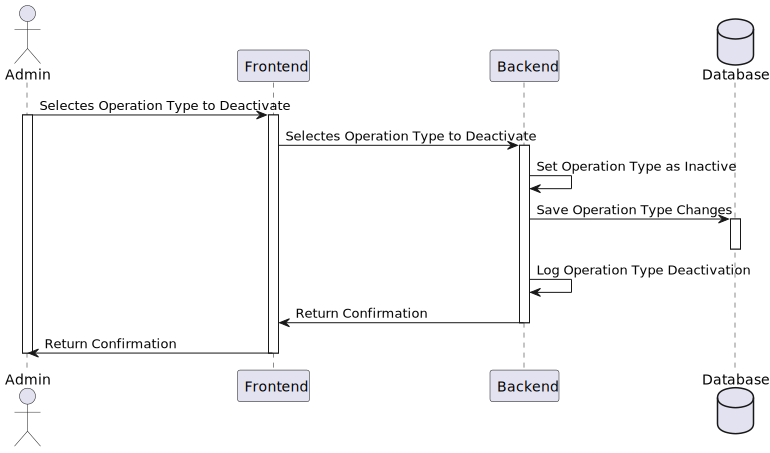
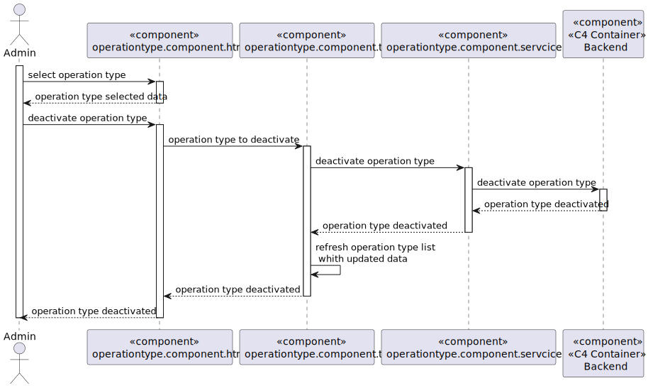

# US 6.2.20 Remove Operation Type (UI for US 5.1.22)

As an Admin, I want to remove obsolete or no longer performed operation types, so that the system stays current with hospital practices.

## 1. Context

This US is the *Frontend* version of [**US 5.1.22**](../../sprint-a/us22/readme.md).

## 2. Requirements

### 2.1. Acceptance Criteria

1. Admins can search for and mark operation types as inactive (rather than deleting them) to preserve historical records.
2. Inactive operation types are no longer available for future scheduling but remain in historical data.
3. A confirmation prompt is shown before deactivating an operation type.

### 2.2. Dependencies

This **US** depends on:
* [**US 5.1.22**] since this functionality calls the *Web API* request to search and deactivate **Operation Types**.
* [**US 5.1.20**] since this functionality calls there needs to be  **Operation Types**.

### 2.3. Pre-Conditions

For this **US** to work, there needs to be **Operation Types** inside the system, hence the dependency on [**US 5.1.20**].

### 2.4. Open Questions

This **US** has no **Open Questions** yet.

## 3. Analysis

This *US* is the *Frontend version* of another **US**, which contains the logic. Thus, this section does not apply here.

## 4. Design

The team decided the following aspects:

* The user should be able to search for an existing operation type.
* After selecting an operation type, the user should be able, with the press of a button or similar, to mark it as inactive.

## 5. C4 Views

### Level 1

### Level 2

### Level 3

## 6. Tests

-

## 7. Implementation

-

## 8. Demonstration

-
