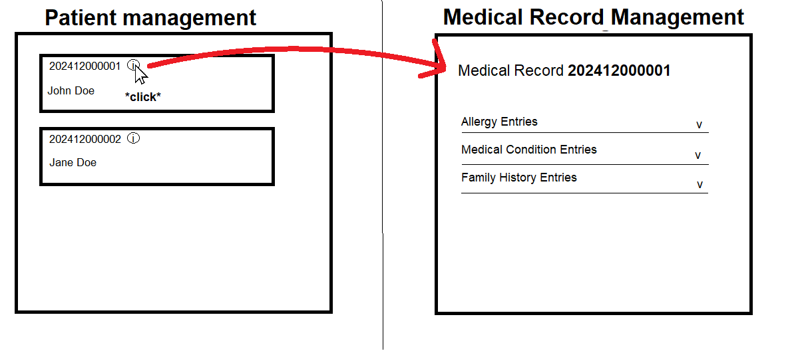

# US 7.2.14 - Access a Patient's Medical Record

As a **Doctor**, I want to include the access of the **Patient Medical Record** during the patient profile visualization and management, so that I can manage it in that context.

## 1. Context

This **US** is part of the **Frontend** component.

## 2. Requirements

### 2.1. Acceptance Criteria

1. A doctor must be able to access a **Patient's Medical Record** when managing a patient.

### 2.2. Dependencies

This **US** depends on the **patient management** functionalities ([6.2.6](../../sprint-b/6-2-6/readme.md), [6.2.7](../../sprint-b/6-2-7/readme.md), [6.2.8](../../sprint-b/6-2-8/readme.md), [6.2.9](../../sprint-b/6-2-9/readme.md)).

### 2.3. Pre-Conditions

* A **Patient** must exist.

### 2.4. Open Questions

**Question 1:** This US implies that the Doctor has access to the patient profile management functionalities, but those functionalities are assigned to the Admin according to the previous Sprint. Should we give the Doctor those permissions too?

**Answer 1:** 
for clarification, the Admin will be able to manage the user profile (as of sprint A) while the doctor will be able to manage the medical history/medical record. treat those as two separate responsibilities by two different user roles.
Keep in mind that during Sprint A, the medical record was a free text field, and now we are adding a "full-fledged" medical record management feature 

**Question 2:**
If im understanding the user story correctly, when the user opens de patient profile, it should be possible to view the data from the medical record, correct?

**Answer 2:**
that's correct

## 3. Analysis

Through the requisites and open questions, the team concludes that:
* A doctor must be able to access a **Patient's Medical Record** when they're in a patient management screen.

## 4. Design

The team decided that the page transition should look like this:

## 5. Implementation

-

## 6. Demonstration

-