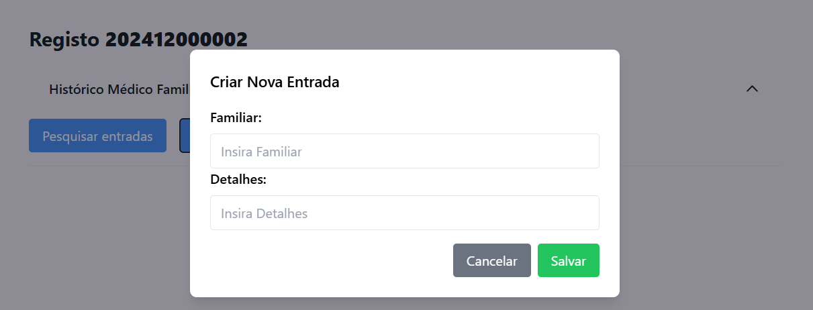

# US 7.2.20 - Add Family History entry in Medical Record

As a **Doctor**, I want to add an entry about **family history** in the medical record of a patient.

## 1. Context

This **US** is part of the new **Express Backend** module. It also has a **Frontend** component.

## 2. Requirements

### 2.1. Acceptance Criteria

1. A doctor must be able to update a **Patient's Medical Record**, adding entries about **family history**.

### 2.2. Dependencies

This **US** depends on:
* [**US 7.2.1**](../7-2-1/readme.md), since this functionality is done in the **Express Backend**.

### 2.3. Pre-Conditions

* A **Patient** must exist.

### 2.4. Open Questions

**Question 1:** O medical record pode incluir várias alergies e medical conditions. Estas informações são suficientes ou considera necessário um campo de texto livre?

**Answer 1:** 
sim. pode incluir o registo de várias alergias e conditions.

um exemplo de um registo médico é o seguinte:

(...)

**Histórico Médico Familiar**
* Pai: Hipertensão arterial, Diabetes Tipo 2.
* Mãe: Asma, Osteoporose.
* Irmãos: Sem histórico médico significativo.

(...)

(Only the part that's relevant to this **US**).

## 3. Analysis

Through the requisites and open questions, the team concludes that:
* A doctor must be able to add **family history** entries in a patient's **medical record**.
* An entry must contain:
    * Relative
    * List of allergies / medical conditions (or a message simbolizing that there's no relevant medical history).
* The team will need to create a new type in the backend representing the **Family history Entry** and add a list of these to the **Medical Record** type.

## 4. Design

The team decided that:
* There will be list of possible relatives (father, mother, etc.) instead of it being an open string.
* After creation, the new entry will be registered and visible in the frontend.

## 5. C4 Views

The **C4 Views** for this *US* can be viewed [here](views/readme.md).

## 6. Tests

* **familyEntryService.test.ts**

```ts
  mocha.it('creation', async function() {
    // Arrange
    this.timeout(timeout);

    let medicalRecordRepoInstance:IMedicalRecordRepo = Container.get("MedicalRecordRepo");
    sinon.stub(medicalRecordRepoInstance, "findByMedicalRecordNumber").returns(Promise.resolve(seedMedicalRecord()));

    let familyHistoryRepoInstance:IFamilyHistoryEntryRepo = Container.get("FamilyHistoryRepo");
    sinon.stub(familyHistoryRepoInstance, "findByMedicalRecordNumber").returns(Promise.resolve([seedFamilyEntry()]));
    sinon.stub(familyHistoryRepoInstance, "save").returns(Promise.resolve(seedFamilyEntry()));

    // Act
    const serv = new FamilyHistoryEntryService(familyHistoryRepoInstance, medicalRecordRepoInstance);

    const output = (await serv.createFamilyHistoryEntry(seedNewFamilyEntryDTO())).getValue();
  
    // Assert
    expect(serv).to.not.be.undefined;
    expect(output.entryNumber).to.be.eq('202412000002002') // entry number foi gerado
  });
```

* **familyEntryController.test.ts**

```ts
    mocha.it('familyHistoryEntryController create unit test using familyHistoryEntryService stub', async function () {
        // Arrange
        this.timeout(timeout);
        const body = { 
            "medicalRecordNumber": "202412000002",
            "relative": "Mãe",
            "history": "Asma, Osteoporose."
        };
    
        const req: Partial<Request> = { body };
        const jsonSpy = sinon.spy();
        const res: Partial<Response> = {
            json: jsonSpy, 
        };
        const next: Partial<NextFunction> = () => {};
    
        const familyHistoryEntryServiceInstance: IFamilyHistoryEntryService = Container.get("FamilyHistoryEntryService");
        sinon.stub(familyHistoryEntryServiceInstance, "createFamilyHistoryEntry").returns(
            Promise.resolve(
                Result.ok<IFamilyHistoryEntryDTO>({
                    entryNumber: "202412000002001", 
                    medicalRecordNumber: req.body.medicalRecordNumber,
                    relative: req.body.relative,
                    history: req.body.history,
                })
            )
        );
    
        const ctrl = new FamilyHistoryEntryController(familyHistoryEntryServiceInstance);
    
        // Act
        await ctrl.createFamilyHistoryEntry(req as Request, res as Response, next as NextFunction);
    
        // Assert
        sinon.assert.calledOnce(jsonSpy);
        sinon.assert.calledWith(jsonSpy, sinon.match({ 
            entryNumber: "202412000002001", 
            medicalRecordNumber: req.body.medicalRecordNumber,
            relative: req.body.relative,
            history: req.body.history
        }));
    });

    mocha.it('familyHistoryEntryController + familyHistoryEntryService create integration test using familyHistoryEntryRepository stub', async function () {	
        // Arrange	
        this.timeout(timeout);
        const body = { 
            "medicalRecordNumber": "202412000002",
            "relative": "Mãe",
            "history": "Asma, Osteoporose."
        };
        
        const req: Partial<Request> = { body };
        const jsonSpy = sinon.spy();
        const res: Partial<Response> = {
            json: jsonSpy, 
        };
        const next: Partial<NextFunction> = () => {};

        let medicalRecordRepoInstance:IMedicalRecordRepo = Container.get("MedicalRecordRepo");
        sinon.stub(medicalRecordRepoInstance, "findByMedicalRecordNumber").returns(Promise.resolve(MedicalRecord.create({medicalRecordNumber:"202412000002"}).getValue()));

        let familyHistoryEntryRepoInstance:IFamilyHistoryEntryRepo = Container.get("FamilyHistoryEntryRepo");
        sinon.stub(familyHistoryEntryRepoInstance, "findByMedicalRecordNumber").returns(Promise.resolve([]))
        sinon.stub(familyHistoryEntryRepoInstance, "save").returns(new Promise<FamilyHistoryEntry>((resolve, reject) => {
            resolve(FamilyHistoryEntry.create({
                entryNumber: "202412000002001", 
                medicalRecordNumber: req.body.medicalRecordNumber,
                relative: req.body.relative,
                history: req.body.history,
            }).getValue())
        }));

        let familyHistoryEntryServiceInstance = Container.get("FamilyHistoryEntryService");

        const ctrl = new FamilyHistoryEntryController(familyHistoryEntryServiceInstance as IFamilyHistoryEntryService);

        // Act
        await ctrl.createFamilyHistoryEntry(<Request>req, <Response>res, <NextFunction>next);

        // Assert
        sinon.assert.calledOnce(jsonSpy);
        sinon.assert.calledWith(jsonSpy, sinon.match({ 
            entryNumber: "202412000002001", 
            medicalRecordNumber: req.body.medicalRecordNumber,
            relative: req.body.relative,
            history: req.body.history
        }));
    });
    mocha.it('familyHistoryEntryController + familyHistoryEntryService integration test using spy on familyHistoryEntryService', async function () {		
        // Arrange
        this.timeout(timeout);
        const body = { 
            "medicalRecordNumber": "202412000002",
            "relative": "Mãe",
            "history": "Asma, Osteoporose."
        };
        
        const req: Partial<Request> = { body };
        const jsonSpy = sinon.spy();
        const res: Partial<Response> = {
            json: jsonSpy, 
        };
        const next: Partial<NextFunction> = () => {};

        let medicalRecordRepoInstance:IMedicalRecordRepo = Container.get("MedicalRecordRepo");
        sinon.stub(medicalRecordRepoInstance, "findByMedicalRecordNumber").returns(Promise.resolve(MedicalRecord.create({medicalRecordNumber:"202412000002"}).getValue()));

        let familyHistoryEntryRepoInstance:IFamilyHistoryEntryRepo = Container.get("FamilyHistoryEntryRepo");
        sinon.stub(familyHistoryEntryRepoInstance, "findByMedicalRecordNumber").returns(Promise.resolve([]))
        sinon.stub(familyHistoryEntryRepoInstance, "save").returns(new Promise<FamilyHistoryEntry>((resolve, reject) => {
            resolve(FamilyHistoryEntry.create({
                entryNumber: "202412000002001", 
                medicalRecordNumber: req.body.medicalRecordNumber,
                relative: req.body.relative,
                history: req.body.history,
            }).getValue())
        }));

        let familyHistoryEntryServiceInstance:IFamilyHistoryEntryService = Container.get("FamilyHistoryEntryService");

        const familyHistoryEntryServiceSpy = sinon.spy(familyHistoryEntryServiceInstance, "createFamilyHistoryEntry");

        const ctrl = new FamilyHistoryEntryController(familyHistoryEntryServiceInstance as IFamilyHistoryEntryService);
        // Act
        await ctrl.createFamilyHistoryEntry(<Request>req, <Response>res, <NextFunction>next);

        // Assert
        sinon.assert.calledOnce(jsonSpy);
        sinon.assert.calledWith(jsonSpy, sinon.match({ 
            "entryNumber":"202412000002001", 
            "medicalRecordNumber":req.body.medicalRecordNumber,
            "relative":req.body.relative,
            "history":req.body.history,
        }));
        sinon.assert.calledOnce(familyHistoryEntryServiceSpy);
        //sinon.assert.calledTwice(roleServiceSpy);
        sinon.assert.calledWith(familyHistoryEntryServiceSpy, sinon.match({
            "medicalRecordNumber":req.body.medicalRecordNumber,
            "relative":req.body.relative,
            "history":req.body.history,
        }));
    });

    it('familyHistoryEntryController unit test using familyHistoryEntryService mock', async function () {		
        // Arrange
        this.timeout(timeout);
        const body = { 
            "medicalRecordNumber": "202412000002",
            "relative": "Mãe",
            "history": "Asma, Osteoporose."
        };
        
        const req: Partial<Request> = { body };
        const jsonSpy = sinon.spy();
        const res: Partial<Response> = {
            json: jsonSpy, 
        };
        const next: Partial<NextFunction> = () => {};

        let familyHistoryEntryServiceInstance:IFamilyHistoryEntryService = Container.get("FamilyHistoryEntryService");
        const familyHistoryEntryServiceMock = sinon.mock(familyHistoryEntryServiceInstance)
        familyHistoryEntryServiceMock.expects("createFamilyHistoryEntry")
            .once()
            .withArgs(sinon.match({
                "medicalRecordNumber":req.body.medicalRecordNumber,
                "relative":req.body.relative,
                "history":req.body.history,
            }))
            .returns(Result.ok<IFamilyHistoryEntryDTO>( {
                "entryNumber":"202412000002001",
                "medicalRecordNumber":req.body.medicalRecordNumber,
                "relative":req.body.relative,
                "history":req.body.history,
            } ));

        const ctrl = new FamilyHistoryEntryController(familyHistoryEntryServiceInstance as IFamilyHistoryEntryService);

        // Act
        await ctrl.createFamilyHistoryEntry(<Request>req, <Response>res, <NextFunction>next);

        // Assert
        familyHistoryEntryServiceMock.verify();
        sinon.assert.calledOnce(jsonSpy);
        sinon.assert.calledWith(jsonSpy, sinon.match({ 
            entryNumber: "202412000002001", 
            medicalRecordNumber: req.body.medicalRecordNumber,
            relative: req.body.relative,
            history: req.body.history
        }));
    });
```

## 7. Implementation

### 7.1. Backend section

The only part that's important to point out is the **service**'s method:

```ts
    public async createFamilyHistoryEntry(familyHistoryEntryDTO: IFamilyHistoryEntryDTO): Promise<Result<IFamilyHistoryEntryDTO>> {
        try {
            var medicalRecords = await this.medicalRecordRepo.findByMedicalRecordNumber(familyHistoryEntryDTO.medicalRecordNumber)
            if( medicalRecords === null)
                return Result.fail<IFamilyHistoryEntryDTO>("Medical Record does not exist")

            const entryList = await this.familyHistoryEntryRepo.findByMedicalRecordNumber(familyHistoryEntryDTO.medicalRecordNumber);
            familyHistoryEntryDTO.entryNumber = familyHistoryEntryDTO.medicalRecordNumber + String(entryList.length+1).padStart(3,'0');
            
            const familyHistoryEntryOrError = await FamilyHistoryEntry.create(familyHistoryEntryDTO)
            if (familyHistoryEntryOrError.isFailure) {
                return Result.fail<IFamilyHistoryEntryDTO>(familyHistoryEntryOrError.errorValue())
            }

            const familyHistoryEntryResult = familyHistoryEntryOrError.getValue()
            await this.familyHistoryEntryRepo.save(familyHistoryEntryResult)

            const familyHistoryEntryResultDTO = FamilyHistoryEntryMap.toDTO(familyHistoryEntryResult) as IFamilyHistoryEntryDTO
            return Result.ok<IFamilyHistoryEntryDTO>(familyHistoryEntryResultDTO)
        } catch (err) {
            throw err
        }
    }
```

* We verify if the **medical record** exists. Since **mongoDB** is a non-relational database (it doesn't have foreign keys), this validation **must** be done here.
* We generate an **entry number**, a domain identifier for the **family history entry**.

## 8. Demonstration

