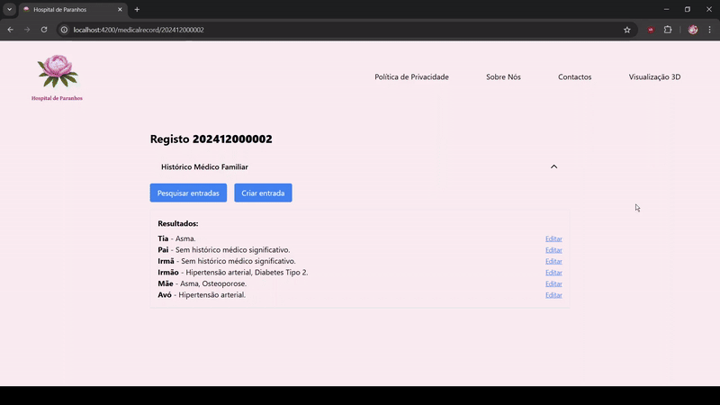

# US 7.2.21 - Update Family History entry in Medical Record

As a **Doctor**, I want to add an entry about **family history** in the medical record of a patient.

## 1. Context

This **US** is part of the new **Express Backend** module. It also has a **Frontend** component.

## 2. Requirements

### 2.1. Acceptance Criteria

1. A doctor must be able to update a **Patient's Medical Record**, adding entries about **family history**.

### 2.2. Dependencies

This **US** depends on:
* [**US 7.2.1**](../7-2-1/readme.md), since this functionality is done in the **Express Backend**.

### 2.3. Pre-Conditions

* A **Patient** must exist.
    * That **Patient's Medical Record** must contain a **Family History Entry**.

### 2.4. Open Questions

No Open Questions yet.

## 3. Analysis

Through the requisites and open questions, the team concludes that:
* A doctor must be able to edit a **family history** entry in a patient's **medical record**.
* The doctor should be able to edit the **relative** associated with it and its **history description**.

## 4. Design

The team decided that:
* After accessing a patient's medical record, each **family history entry** should have an "Edit" button. That allows the user to edit the previously mentioned attributes (USABILITY).

## 5. C4 Views

The **C4 Views** for this *US* can be viewed [here](views/readme.md).

## 6. Tests

* Test that the attributes are changed after the edit.

```ts
  mocha.it('edit', async function() {
    // Arrange
    this.timeout(timeout);

    let medicalRecordRepoInstance:IMedicalRecordRepo = Container.get("MedicalRecordRepo");

    let familyHistoryRepoInstance:IFamilyHistoryEntryRepo = Container.get("FamilyHistoryRepo");
    sinon.stub(familyHistoryRepoInstance, "findByEntryNumber").returns(Promise.resolve(seedFamilyEntry()));
    sinon.stub(familyHistoryRepoInstance, "save").returns(Promise.resolve(seedFamilyEntry()));

    // Act
    const serv = new FamilyHistoryEntryService(familyHistoryRepoInstance, medicalRecordRepoInstance);
    const input = seedFamilyEntry();
    const output = (await serv.editFamilyHistoryEntry(input.entryNumber, seedHistoryChange())).getValue();
  
    // Assert
    expect(serv).to.not.be.undefined;
    expect(input.entryNumber).to.be.eq(output.entryNumber) // entry number não mudou
    expect(input.relative).to.be.eq(output.relative) // relative não mudou

    expect(input.history).to.not.be.eq(output.history) // history mudou
    expect(output.history).to.be.eq(seedHistoryChange().history)
  });
```

## 7. Implementation

* **medicalrecord.component.ts**

```ts
  async submitEdit(entry: FamilyHistoryEntry | null): Promise<void> {
    const searchParams: {relative?:string, history?: string} = {};

    for (const [key, field] of Object.entries(this.fields)) {
      if (field.selected) {
        searchParams[key as keyof {relative:string, history: string}] = field.value;
      }
    }

    try{
      var result = await this.medicalRecordService.editFamilyHistoryEntry(this.token, entry!.entryNumber, searchParams);
      console.log("edit successful")
      const entryToChange = this.familyHistoryResults?.find(e => e.entryNumber === entry!.entryNumber);
      if (searchParams.history) entryToChange!.history = searchParams.history; 
      if (searchParams.relative) entryToChange!.relative = searchParams.relative; 
    } catch (error) {
      console.log("oops");
    } finally {
      this.isEditing = false;
      this.resetFields();
    }
  }
```

When an entry is changed, that change is reflected in the backend and, if successful, automatically done in the frontend's listing to use less resources.

* **familyHistoryEntryRoute.ts**

```ts 
    route.patch(`/:entryNumber`, //Edit
        celebrate({
            params: Joi.object({
                entryNumber: Joi.string().required()
            }),
            body: Joi.object({
                relative: Joi.string(),
                history: Joi.string()
            })
        }),
        (req, res, next) => ctrl.editFamilyHistoryEntry(req, res, next)
    )
```

The backend request for this functionality is a HTTP Patch.

## 8. Demonstration

